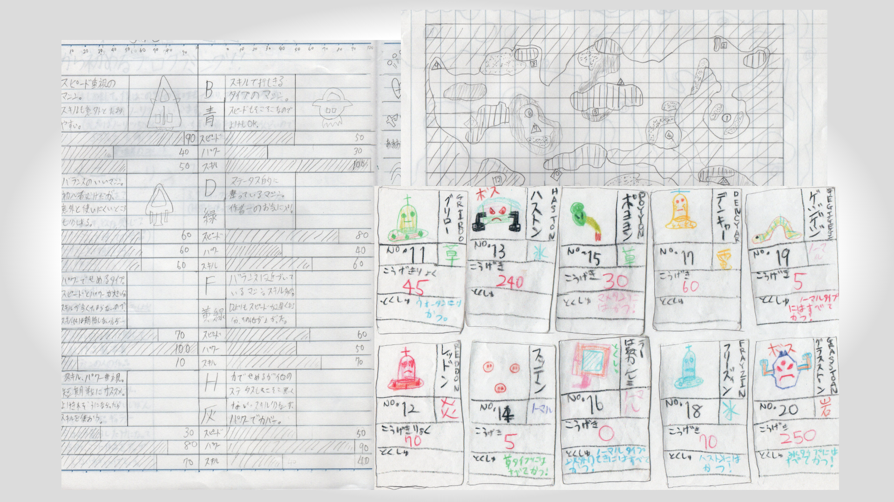
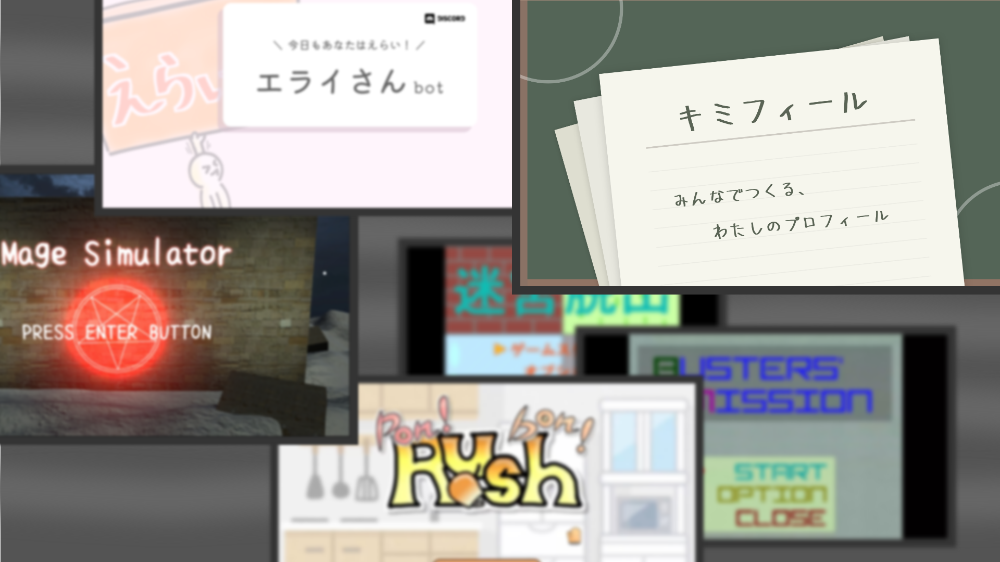
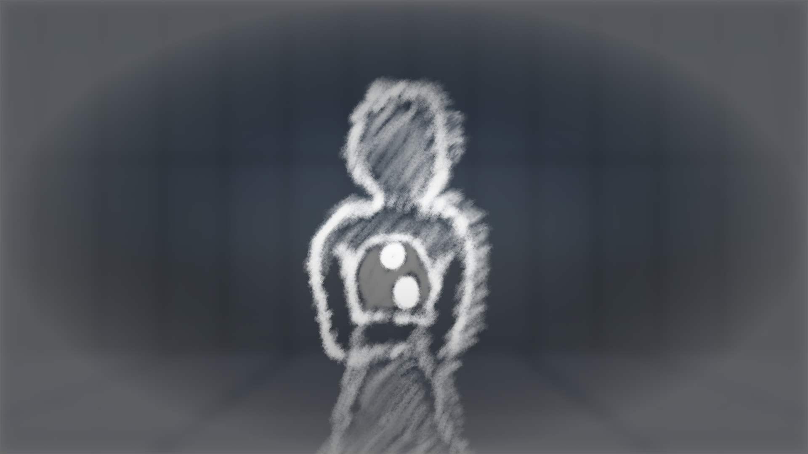

かつて、私たちには「みんなで遊びを作る」「独自の世界観を守る」という二面性があった。世界観を絵に描いて、周りの子たちと一緒に遊びへ昇華する。そんな活動が出発点だった。

時が経って、色んな世界に触れて、色んな知識や経験を得て、色んなものを作った。しかし同時に、これは可能性の発散を意味してた。そして結局、元の二面性は乖離し、私たちはどこかに取り残されてしまった。

しばらく漂い続けた私たちは、今まで見えたもの、思ったこと、選んだものに潜在的な意図があることに気付いた。それはまるで「抽象的な何か」が見えて、その意味を知るために行動しているみたいだった。

それぞれの行き先を辿るため、私たちは見えてくるものを手掛かりに、解釈を作り続けていくことにした。この活動はたった今、『RineaR』と名付けられた。

