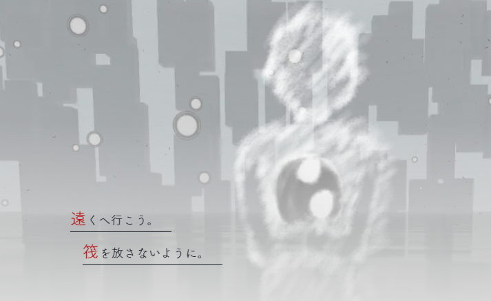
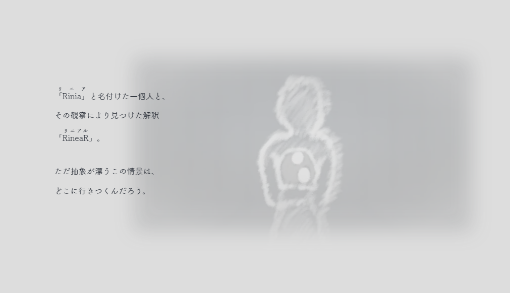
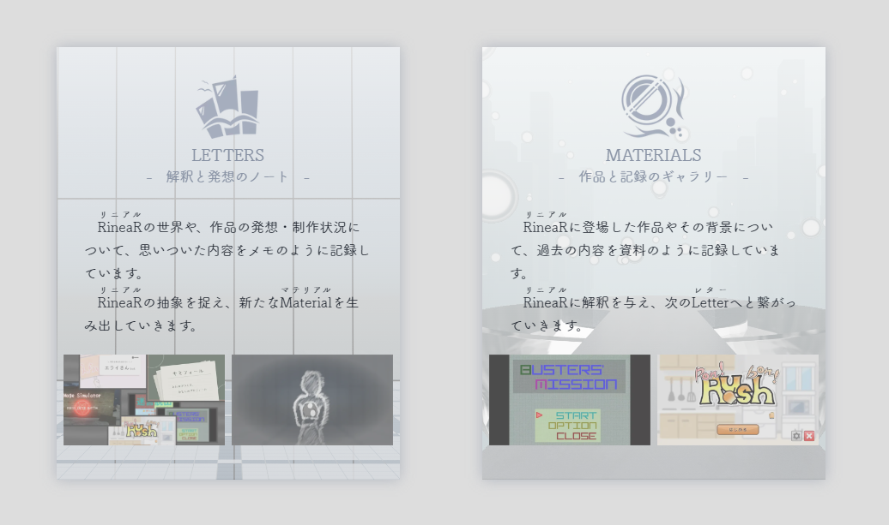
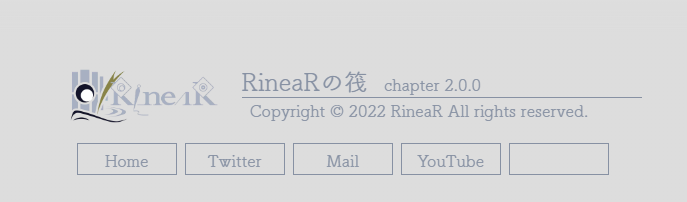

# chap.2 での変化点

「RineaRの筏」がchap.2になり、デザインが大きく変わったほか、**RineaR全体の構想も変化**した。

chap.1では、現実の内部に「抽象によって現実と隔離された場所」があって、そこで「ある一個人」の抽象として漂い続けているイメージだった。

対してchap.2では、**現実の外部に「抽象を通してのみ現実を観察できる場所」があって、そこから「ある一個人」を見続けているイメージ**になった。

## キャッチフレーズ

旧） この筏は私を、どこへ連れてゆくんだろう。

▼

新） **遠くへ行こう。筏を放さないように。**

## RineaRとは何か

旧）Riniaの個人活動の総称。

▼

新）**Riniaと名付けた一個人を観察して得られた解釈。**

## RineaRとRiniaの読み

旧）「RineaR」の読みは「りにあ」。「Rinia」の読みも「りにあ」。

▼

新）「RineaR」の読みは **「リニアル」** 。「Rinia」の読みは **「リニア」** 。

## Letter, Materialの役割

旧）**活動者による投稿**。前者は書き留めておきたいこと、後者は一連の活動。

▼

新）**個人的なノート**。前者は解釈と発想、後者は作品と記録。また、LetterはMaterialを生み出し、MaterialはLetterの進展を促す。

## コンテンツのレギュレーション

旧）文章は、**プレゼンやブログをイメージ**した敬体・口語体。コンテンツには、**技術的な解説を含む**。

▼

新）文章は、**日記をイメージ**したやや砕けた文語体。コンテンツには、技術的な解説を含まず、**エピソードを含む**。

## バージョン表記

旧）`version 1.x.x`

▼

新）`chapter 2.x.x`（chapterの概念が追加されたのも、chap.2から。）

# きっかけ

## そもそも、RineaRとは何か

まず、はっきり書いておくと、**「RineaR」が何かは分かってない**。ただ、得体のしれない独自概念に名前だけを付けたもの。

だから、今回は意味が変わったし、これからも変わっていくと思う。

## 「個人の活動」と意味付けするには無理がある

今までの解釈は、**RineaRはRiniaという人物による個人活動のことで、Riniaは抽象を用いてRineaRを現実から隔離させている**というもの。時間が経つにつれて、これには無理があるように思えてきた。

RineaRは「抽象を眺めている」わけだけれど、**RiniaはRineaRの活動者ではなく、見える抽象の中でもひときわ関心がある一存在**とも言える。だから、まるで設計をやり直すみたいに、独自概念に対して解釈を変えて、その辻褄を合わせた。

その結果が**RineaRは、Riniaと名付けた一個人を観察して得られた解釈**という解釈。

## キャッチフレーズは大事に温めていたもの

以前はRiniaが「RineaRの筏」を拠点として個人活動をしているという解釈だったので、キャッチフレーズもまた噛み合わなくなった。

でも、新しいキャッチフレーズも何か具体的な意味があるのかと言われると、わからない。少なくとも、**「遠くへ行こう。」はRineaRの姿あるままを表しているようで、ずっと前から大事に温めてあった。**

## ここのコンテンツは、縛りから解放された気がする

LetterやMaterialも、RineaRの変化に伴って解釈が変化した。これらはもともと「活動者による投稿」だったが、それが新しく **「観察の記録と考察」** になった。

また、コンテンツの内容や文体が変化したのも、**もはや「外部へ向けた説明」である必要がなくなった**から。これによって何か縛りのようなものが解けて、より自由な解釈ができるようになった気がする。そういった意味でも、RineaRの解釈を変えたのは良かったのかもしれない。

## そのほかの理由

読みの変更は紛らわしいから。両方とも同じ読みなのが紛らわしくて、普段から「リニアル」と呼ぶようになってた。

最後に、バージョン表記は、個人的な趣味。versionよりもchapterの方が、状況が良くなっても悪くなっても先に進んでいるようで安心できる。

# 今後どうなるか

どう解釈が変化していくかは、予想がつかない。ただ、**今後いくつかの作品が控えている**ので、それによってまた新しいものが見えてくるのが今はとても楽しみ。

あと、Materialを時間軸で追いたいので、Timelineページを追加したい。