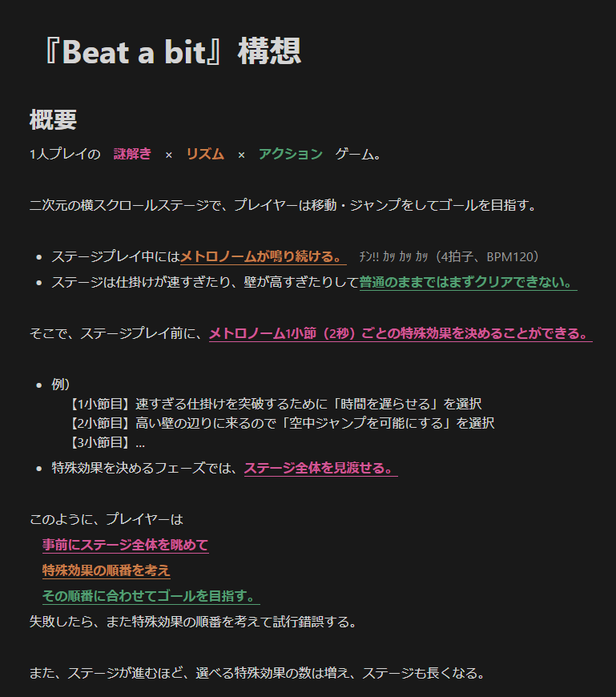
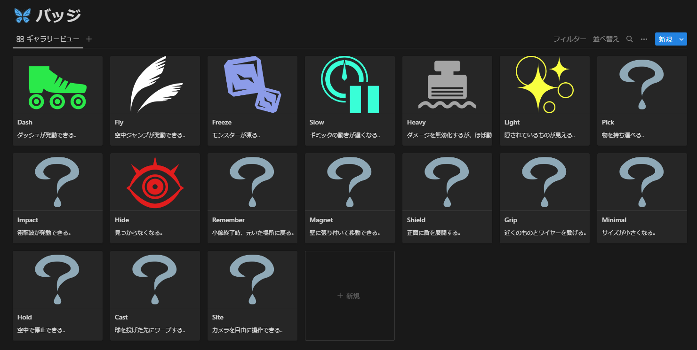

今組み立ててる子がいて、それは **「Beat a bit」と「メイドハイロウ」** 。前者は*2022.09.xx*に構想が思いついたもので、後者は*2019.09.xx*（3年前）から構想があったもの。ここでは「Beat a bit」について、現在どのように見えてるかを書いておく。

# Beat a bit

通称「びとびと」。[ここ](/materials/beat-a-bit)にMaterialとして置いてある。その内容は、**「何秒後にどの能力を使いたいか」を決めた後、キャラクターを操作してゴールを目指す『謎解き』×『リズム』×『アクション』ゲーム**。

最初に具体的な構想をメモしたのは、*2022.09.12*（2ヶ月前）だけど、この作品のゲームコンセプト自体は*2022.06.17*（5ヶ月前）からあった。

## 発想の元は、10年前

この発想には元ネタがあって、それは**10年前に作って公開したゲーム**。名前は忘れたし、Flashだったからもう遊べないけど、内容は覚えてる。プレイ時間1～2分くらいの、本当に小さいゲームだった。見おろし型の2Dアクションで、プレイヤーはイライラ棒みたいな感じで障害物に当たらないように制限時間以内にゴールを目指す。**プレイ開始時には「移動が速くなる」「小さくなる」「制限時間が延びる」といった効果の中から1つだけを選ぶことができる。**

この効果を時間経過でテンポよく変えて遊べたら爽快だろうな、って考えたのが「Beat a bit」の始まり。

## 形にする

*2022.09.20*から作り始めて、途中で[メイドハイロウ](/materials/made-highlow)や[RineaRの筏 chap.2](/materials/rinear-raft-v2)に手を出しながらも順調に進んでる。**今は全体基盤ができて、ステージエディットに取り掛かっている**ところ。ステージ挑戦前に効果を選択する画面もできてて、こんな感じ。

## 「効果」のバリエーションを考える

どの作品でも言えることだけど、眠らせておいたアイデアをいざ実現しようとすると、色々深堀りが必要になったり、更なる改良案を思いついたりする。

これは、*2022.10.03*に**時間ごとに発動できる効果をどんなものにするか**を考えてたときのアイデア。没になったのも含めると**20種類以上**はある。どれを採用して、どの順に解禁しようかな、という感じ。

## 世界観設定をひらめいた

*2022.10.29*、プレイヤーキャラのデザインを考えてるとき、コンセプトがないからどういうキャラにすればいいかが分からなくて、ただの箱でもいいかなと思ってた。こうして困ってるときに、**プレイヤーキャラのコンセプトをアイドルにしたら？** という発想が現れた。そうすると、 **効果をペンライトの色とすればしっくりくる**し、演出とかも入れやすい。

## 今後

[RineaRの筏 chap.2](/materials/rinear-raft-chap2)が完成した今、**次に着手するのは「Beat a bit」になりそう**。この作品については、今後も積極的に情報を公開していこうと思ってる。
