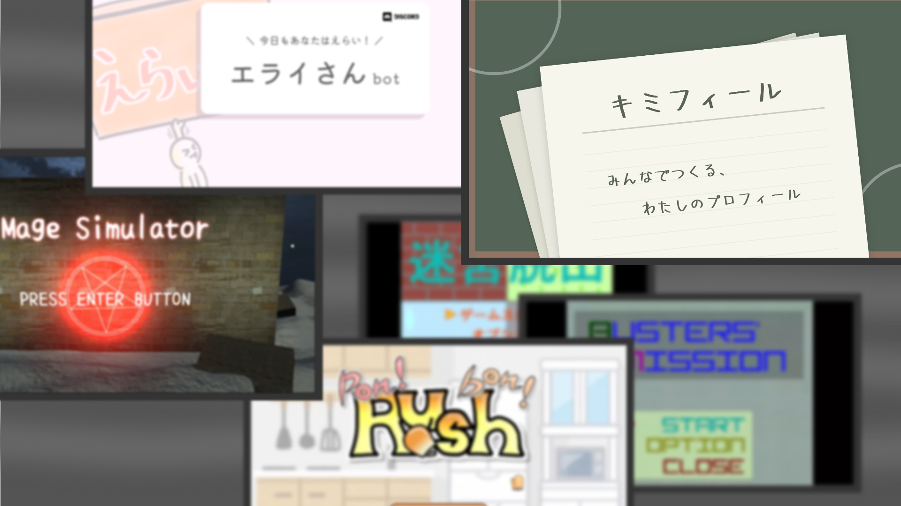

かつて、私たちには「みんなで遊びを作る」「独自の世界観を守る」という二面性がありました。
世界観を絵に描いて、周りの子たちと一緒に遊びへ昇華する。そんな活動が出発点でした。

時が経って、色んな世界に触れて、色んな知識や経験を得て、色んなものを作りました。
しかし同時に、これは可能性の発散を意味していました。結局、元の二面性は乖離し、私たちはどこかに取り残されました。

しばらく漂い続けた私たちは、今まで見えたもの、思ったこと、選んだものに潜在的な意図があることに気付きました。
まるで「抽象的な何か」が見えて、その意味を知るために行動しているようでした。

それぞれの行き先を辿るため、私たちは見えているものを手掛かりに、様々なものを作り続けていくことにしました。
この活動はたった今、『RineaR』と名付けられました。
