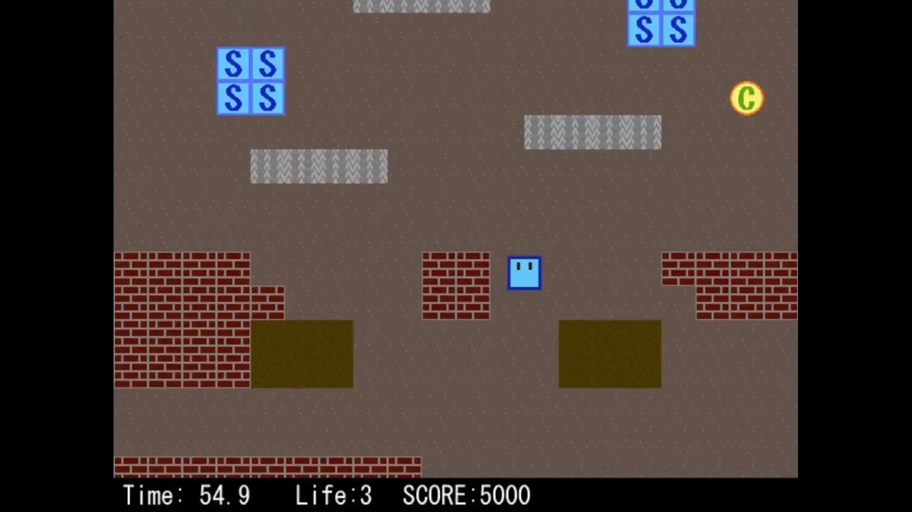
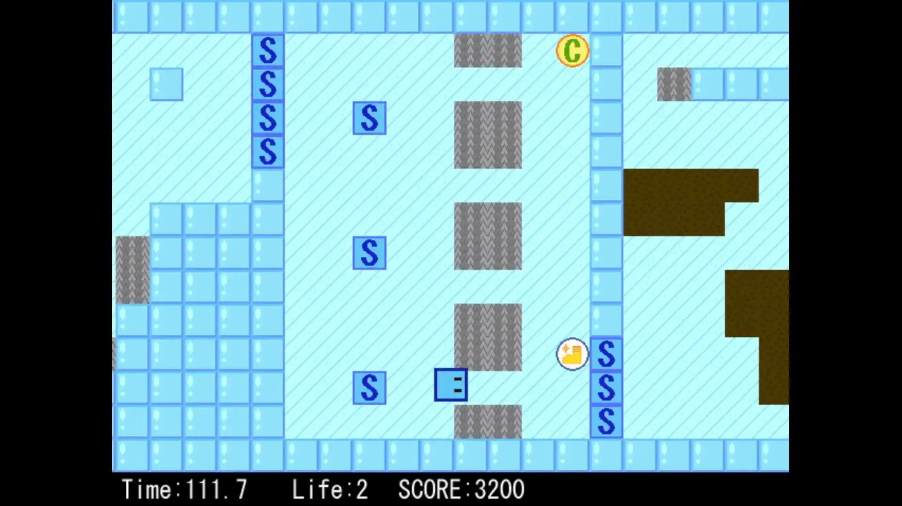
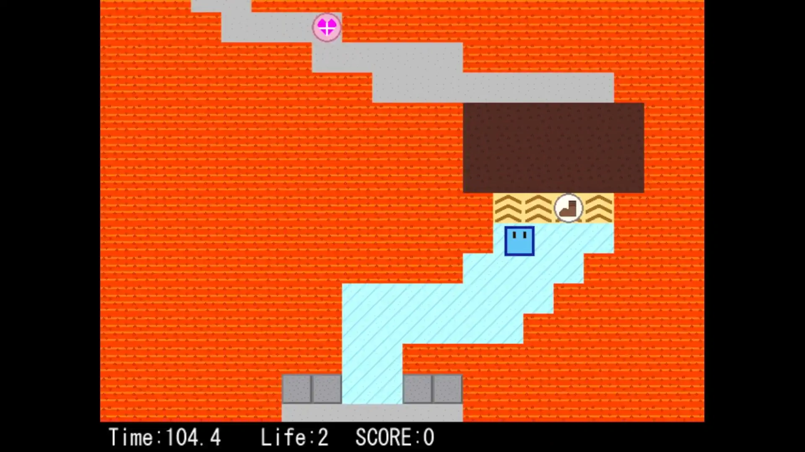
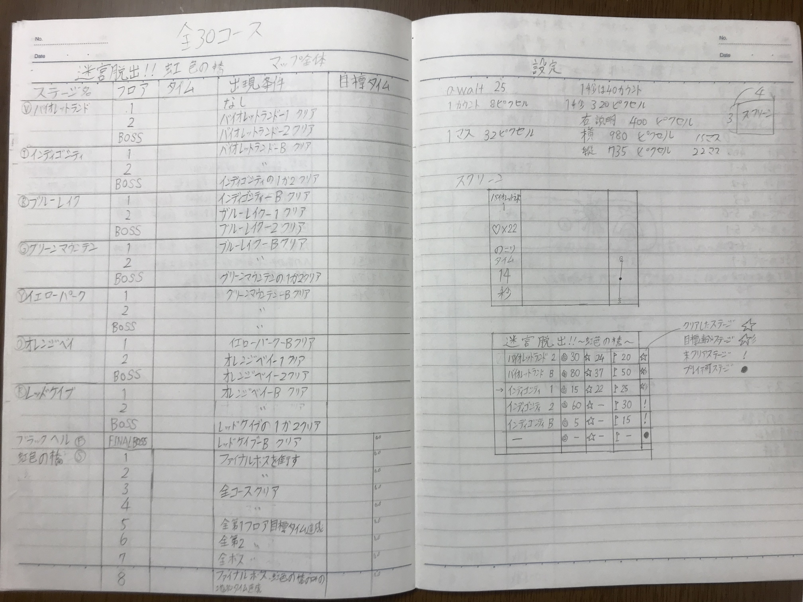
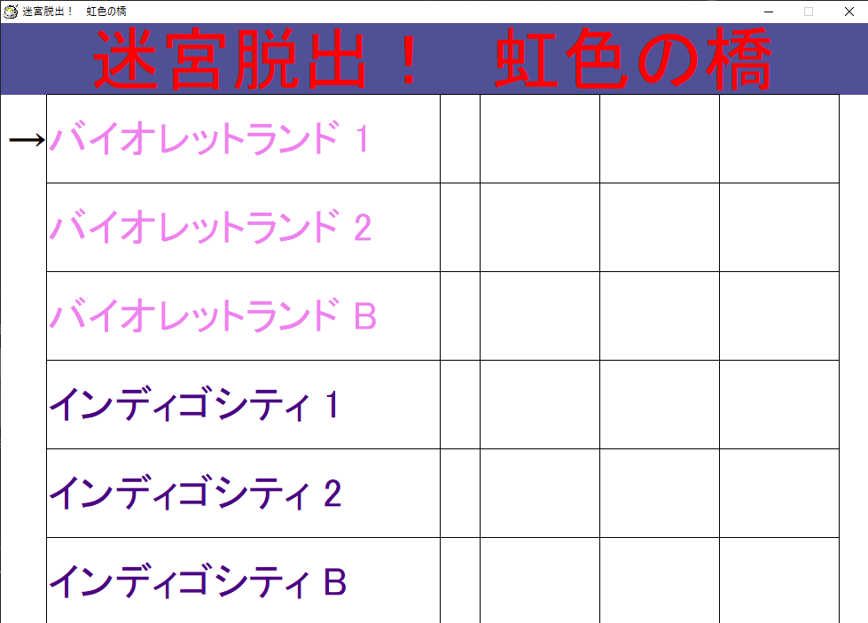
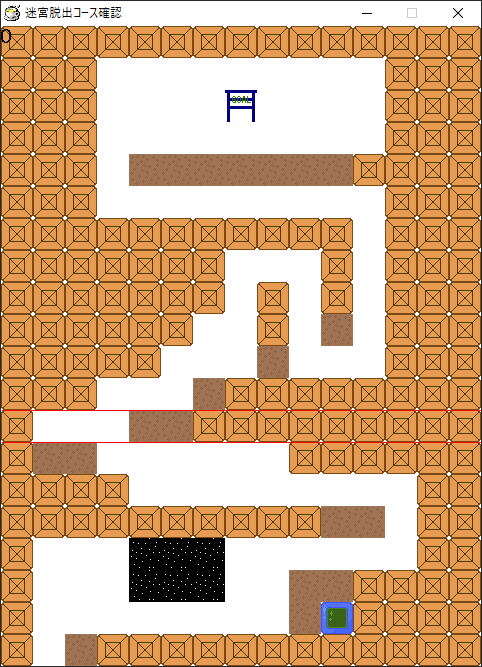
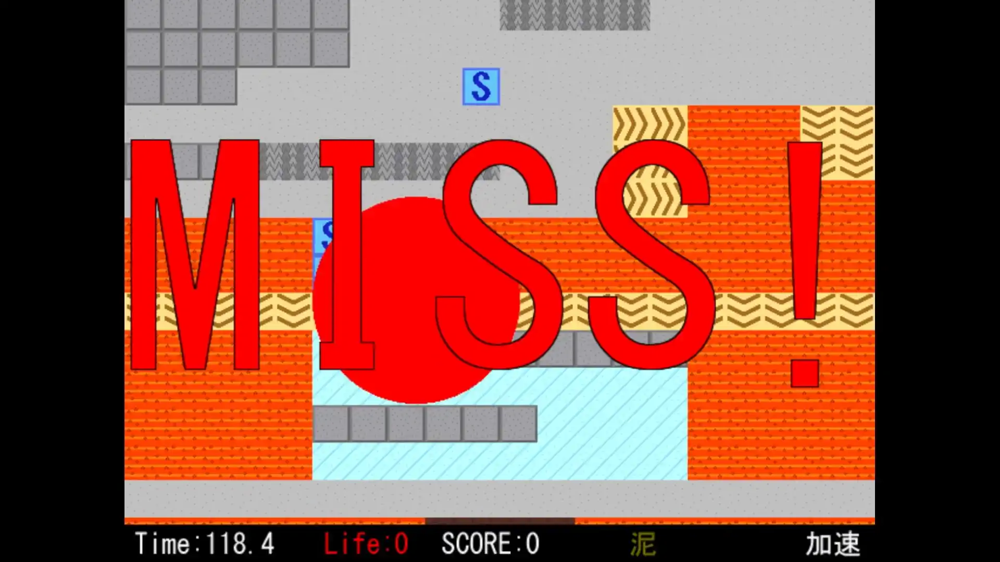
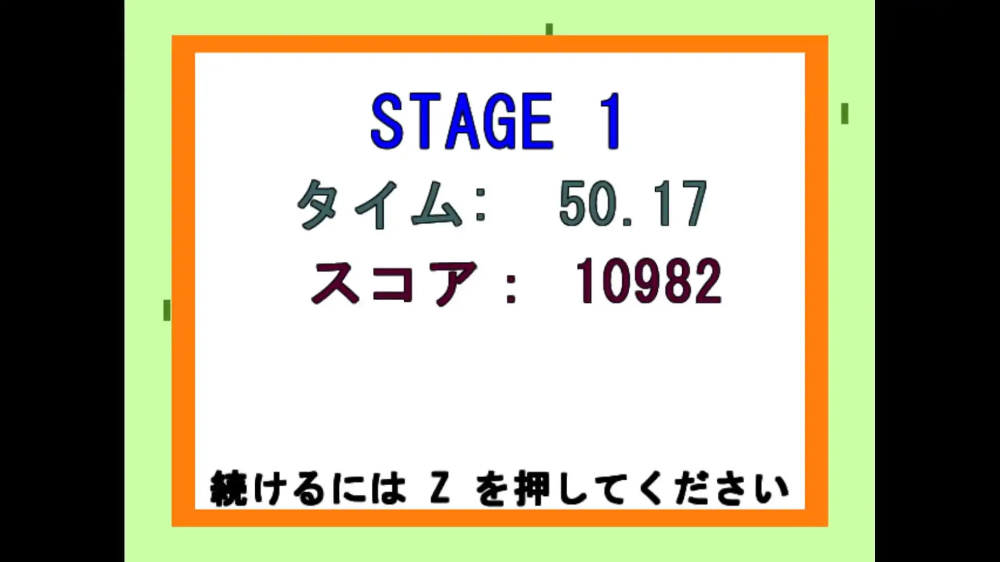
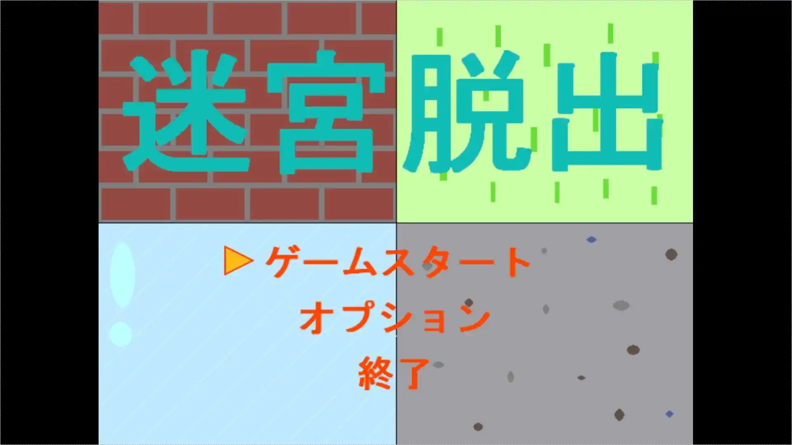

# 現在の形

プレイヤーを上下左右に移動し、**制限時間以内にステージのゴールに触ればクリア。** 残り時間が0になるか、残りライフが0になるとゲームオーバー。ステージ内に散らばっているアイテムを駆使してクリア・高スコアを狙おう！

<iframe src="https://www.youtube.com/embed/WWZ9mK9vg1M" title="YouTube video player" allow="accelerometer; autoplay; clipboard-write; encrypted-media; gyroscope; picture-in-picture" allowFullScreen=""></iframe>

## ステージ紹介

ステージ1は、**泥と針によるギミックがメインのステージ。** スピードアップパネルによる加速や、針無効のアイテムが設置されているため、利用しよう。

ステージ2は、**氷のギミックがメインのステージ。** 氷の上では急に止まれないため、勢い余って針を踏まないように低速移動を活用しよう。また、針が大量に登場する場所は、ダメージ後の無敵時間を利用して一気に駆け抜けてしまうのもアリ。もしくは、氷を一定時間無効化できるアイテムが設置されているため、これを利用して安全に進もう。

ステージ3は、**マグマとベルトコンベアのギミックがメインの最難関ステージ。** 足場が非常に狭い上に不安定なので、正確なコントロールが求められる。マグマの上では常にダメージを受け続けるうえ、移動速度も低下するため無理矢理突っ切ることはできない。ステージの構造やアイテムの場所を把握し、時には慎重に、時にはダメージ覚悟でゴールを目指そう。

# 思い出

## 積み木とおはじき

この作品の最初は、[はじまり](/letters/001)の冒頭よりも前にさかのぼる。

*2008.xx.xx*（8年前）、**積み木で作ったコースを作り、みんなで順番におはじきを弾いてゴールを目指す**ゲームを考えつき、その奇妙な遊びに周りの子たちが寄ってきた。元々は壁があるだけの地味な遊びだったけど、周りの子たちはとても楽しんでいて、だんだん**人気も集まった**。

それからしばらく、ステージを毎回即興で作って、みんなでプレイする日々が続いた。そのうち、アスレチックやアイテム、ボス戦（もちろん人力だけど）が登場して、これは**1つの立派なコンテンツになった。**

## ゲームとして公開、シリーズ化

*2012.xx.xx*（4年前）、**電子ゲームを作って公開する手段を手に入れた**。電子ゲームでまず絶対に作りたかったのが、かつての移動してゴールを目指すだけの作品だった。そして、**最終的に作り終えて公開まで踏み切り、人気を集めてシリーズ化するにまで至った**。この子に「迷宮脱出」と名付けたのもこの時。

1つのステージが1個の作品として投稿されてて、短時間で手軽に遊べるものだった。電子ゲームというのもあって、人力では実現できないギミック（移動する壁、追ってくるマグマ、謎解き要素等）や制限時間が実現できた。新たなステージを出すたびに、コメントにはクリア報告や攻略法がどんどん投稿されていったのも覚えてる。

## 今度は一から作ろうとして

*2013.xx.xx*（3年前）、**もっと自分らしい作品を作れる手段を手に入れた**ため、ありったけの作りたいものを書き出した。この時の作品名は「迷宮脱出！ 虹色の橋」。

だけど、時代の変化によって、周りには以前みたいに一緒に作ったり遊んだりする子もいなくなってた。そんな中、当時の技術でステージ選択画面を作り上げた。

でも、全体を組み上げるほどの力量はまだなく、この時点では完成しなかった。

*2014.04.xx*（2年前）、あらゆる作品の想像・制作を停止してしまい、その後創作活動に目を向けるのは数年後となる。

## 数年経って、再現

*2016.05.xx*、**更に新たな環境と技術を手に入れた**ため、迷うことなく真っ先に**迷宮脱出のリメイク**に取り掛かった。

*2016.10.18*、作品を公開できる機会があった。これに向けて、**知識も経験もないまま、誰からも教えを貰わず、一人疾走してこの子を作り出した**。ステージはテキストファイルで作られてる。プレイヤーキャラが四角なのは、当たり判定の作り方を知らなかったから。

この子は、未熟で孤独な一本道を一緒に走り抜けてくれた、大切な存在なのかもしれない。

