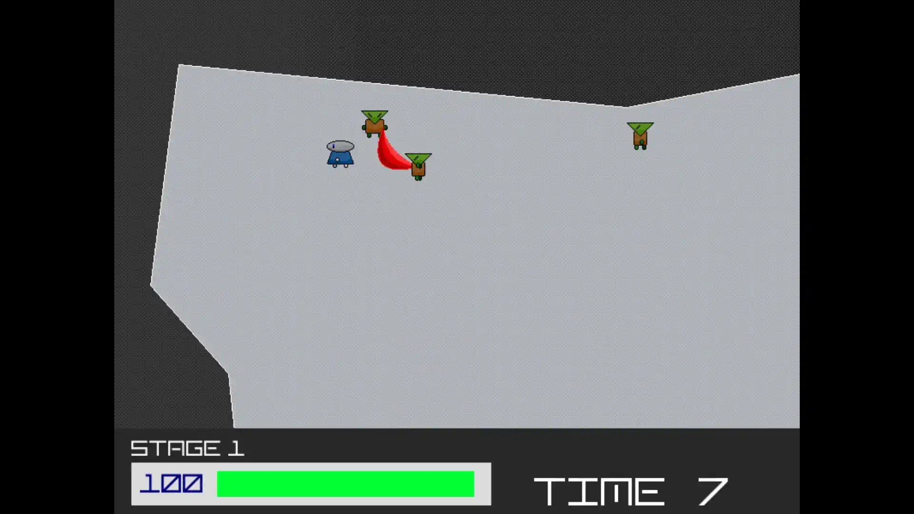
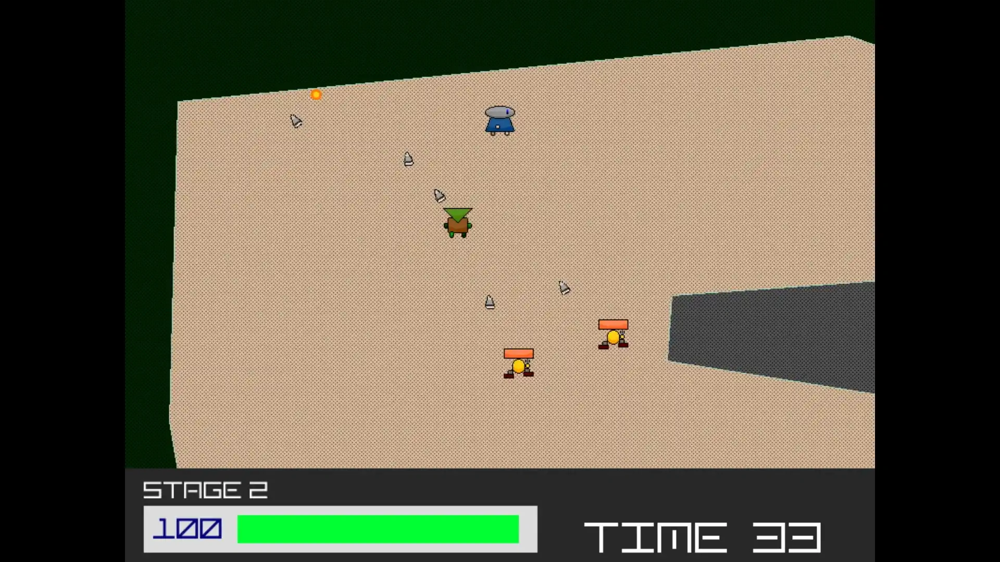
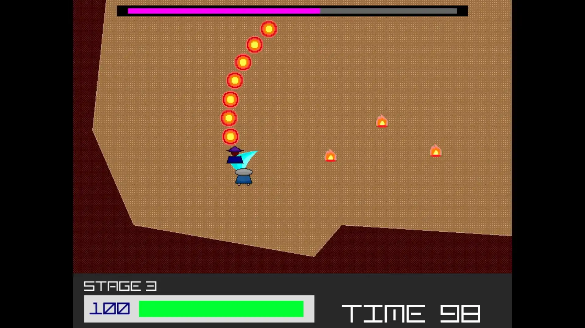
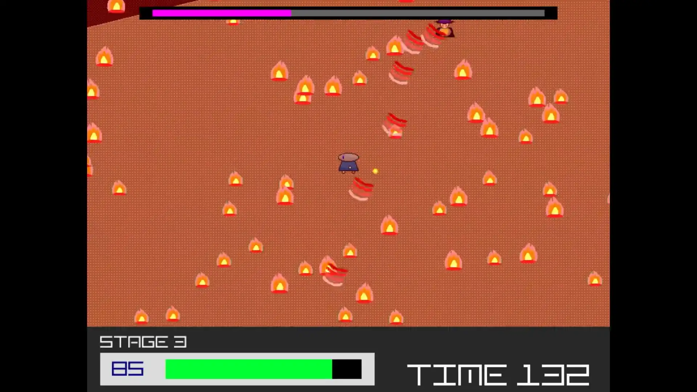
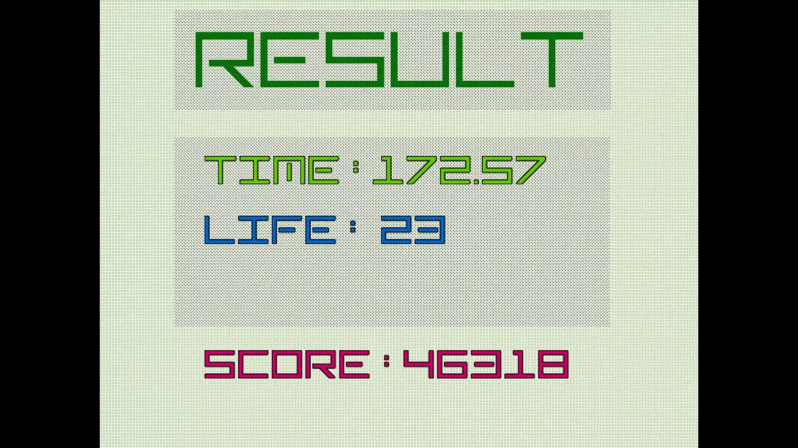
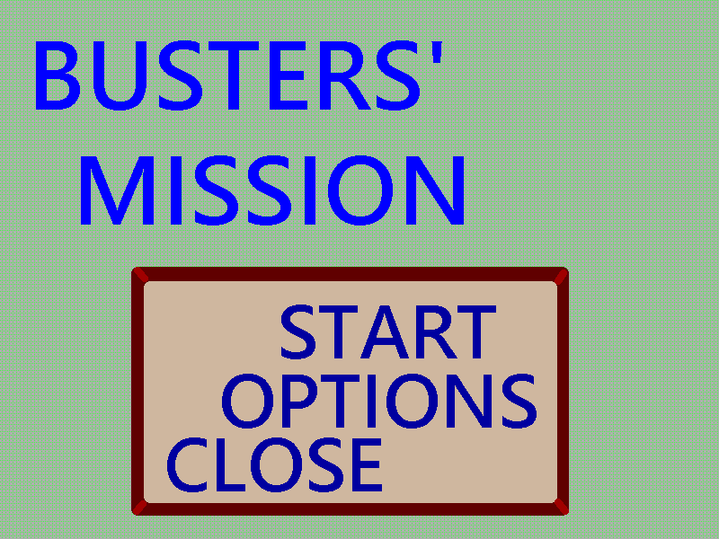
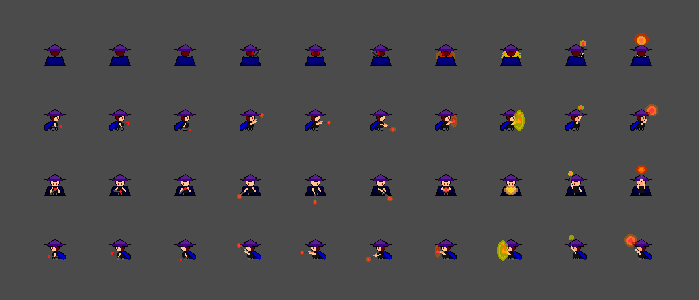
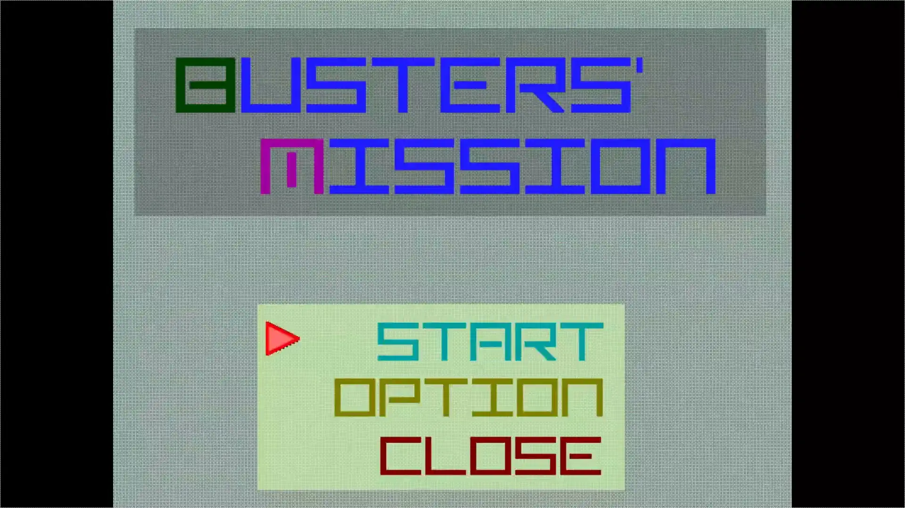

# 現在の形

<iframe src="https://www.youtube.com/embed/YzqFIVbV4-c" title="YouTube video player" allow="accelerometer; autoplay; clipboard-write; encrypted-media; gyroscope; picture-in-picture" allowFullScreen></iframe>

ステージ上の**すべての敵を倒すとステージが進み**、最後のステージに待ち構えるボスを倒すとクリア。クリアすると、残りライフと経過時間からスコアが算出される。残りライフが0になるとゲームオーバー。

## 操作方法

- ↑↓←→：移動
- Z：決定／剣を振る
- M：ポーズメニュー

## ステージ紹介

ステージ1。**プレイヤーを追尾し、剣で近接攻撃してくる敵**が7体いる。なるべくダメージを受けないように、慎重に攻撃していこう。

ステージ2。剣で攻撃する敵に加えて、**プレイヤーの周りを旋回しながら銃で遠距離攻撃してくる敵**が現れる。中央の壁を使って弾を防いで、射撃後の隙に攻撃しよう。

ステージ3。**ボスの体力を0にするとクリア。**

ボスは「プレイヤーの追尾」と「攻撃」を交互に繰り返す。攻撃は3種類あり、それぞれ予備動作が違うため、発動前に判別が可能。

- 杖を振りかぶる動作：**薙ぎ払い**
- 炎を溜める動作：**衝撃波**
- 杖を高く掲げる動作：**メテオ**

どの攻撃が来るかを見極めて回避しよう。

ボスの残りHPが一定以下になると、**大技とともに形態変化を行う。** 

この大技ではボスが杖を掲げ続け、**フィールド全体に大量のメテオが降ってくる**。また、この大技の発動中はボスへ攻撃が与えられないため、避けることに専念しよう。

形態変化以降は**ボスの各攻撃が強化される。** 

さらに、大技の直後はフィールド上にメテオの炎が残った状態で戦うことになるため、炎がない場所にボスを誘導して戦いやすくしよう。

ボスを倒すとクリアとなり、クリア時間と残りライフからスコアが計算される。

# あらすじ

## (1) *2017.09.xx* ／ 発想

この作品は、[迷宮脱出](/materials/maze-escape)のように一本道を走り抜けたものじゃなく、 **焦燥に駆られながら迷いに迷って仕上げたもの。**[迷宮脱出](/materials/maze-escape)を完成させて1年が経っても、作りたいものを思い出せなかった。目の前の状況に釘付けになって、それどころじゃなかった。

**ゲームを作ると決めたうえで、コンセプトに迷ったのはこれが初めて**だったかもしれない。目を閉じれば途端に何かは浮かび上がってくるけれど、もう童心をくすぐられるようなものは出てこなかった。*2014.xx.xx*を最後に発想の機会がなくて衰えていたうえ、[迷宮脱出](/materials/maze-escape)での経験から技術面で制約を課してしまっていたらしい。

## (2) *2018.06.xx* ／ 概念を手繰る

発想を得た後制作を開始したが、**しばらく技術的にも精神的にも迷走してた**。今思えば、この時の迷走は[ポップコーン職人](/materials/popcorn-chef)で長いこと囚われる伏線だったと思う。

*2018.06.xx*、**数学的な興味**からこの作品は本格的に進行していった。それもあって、この作品で最初に完成した部分は**当たり判定**だった。

さらに、この段階で実現のための重要な知識も手に入れた。**この時を境に概念の設計を始めて**、今ではこうしてRineaRがあるとも言える。

## (3) *2018.08.16* ／ 舞台を手繰る

その日から、朝から明け方まで全力で作り続けた。その様子は今見ると、とてもその場しのぎで余裕のないものに見える。

*2018.08.16*、**一回目の表舞台にて作品は完成した**。とにかくギリギリで粗削りな部分も多かったけど、**ゲームバランスだけは奇跡的にとても良かった**。

そういえば、レベルデザインをしてたときの記憶がない。多分これも、技術と時間で板挟みになりながら、苦し紛れに済ませたもの。その割にしては、出来が良いけれど。

## (4) *2018.09.05* ／ 機会を手繰る

その後、*2018.09.05* に公開、*2018.10.21* に二度目の表舞台と、**この子は期待以上の機会を受け取った。**

それもあってか、*2020.04.05*に[ポップコーン職人](/materials/popcorn-chef)が完成するまで、**この子は広告塔となって、幾度とない機会を与えてくれた**。

どの作品についても言えることだけど、その子が与えてくれたいろんな機会がなければ、今の解釈にはたどり着けてない。だから、放さず大事にすることを忘れないで。
