# かつての形

[ここ](https://unityroom.com/games/pon-bon-rush)からプレイ可能。

豆を**調理**して、弾けた**ポップコーンを食べる**と画面下の満腹ゲージが溜まっていく。**2人で同時に**調理を始め、満腹ゲージが先に満タンになったほうが勝ち。

<iframe src="https://www.youtube.com/embed/qf3eXiC_UrM" title="YouTube video player" allow="accelerometer; autoplay; clipboard-write; encrypted-media; gyroscope; picture-in-picture" allowFullScreen></iframe>

## 1. 豆の調理について

豆は時間経過で上からランダムに降ってくる。豆は**ドラッグ＆ドロップすることで移動できる**けど、移動中はカーソル上に出現するゲージが減っていき、0になると移動がキャンセルされる。豆を鍋の外に捨てることはできない。

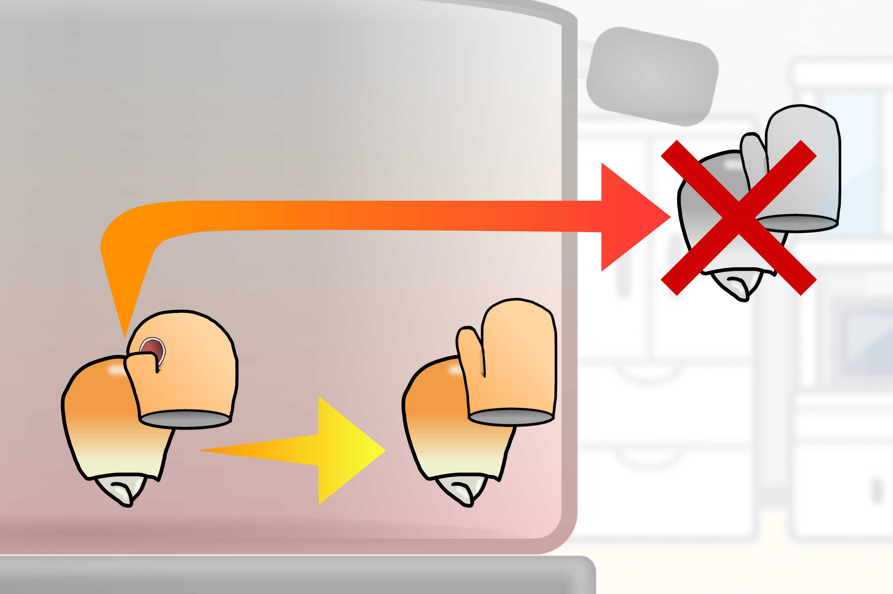

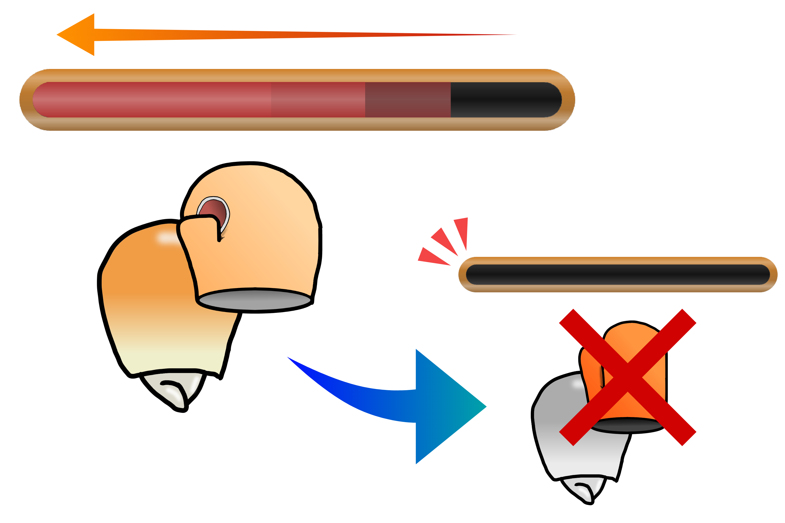

**豆を加熱していくとだんだんと震えていき、弾けてポップコーンになる。** 

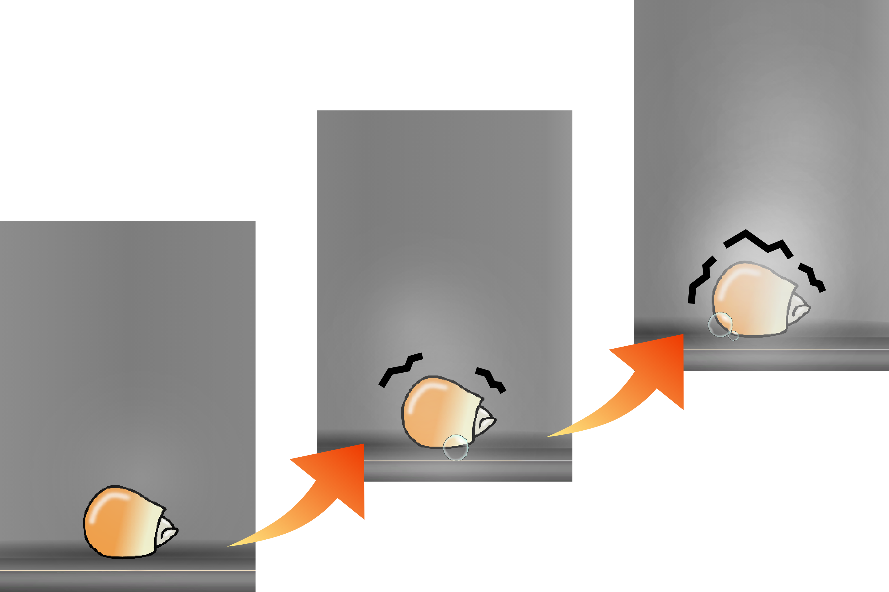

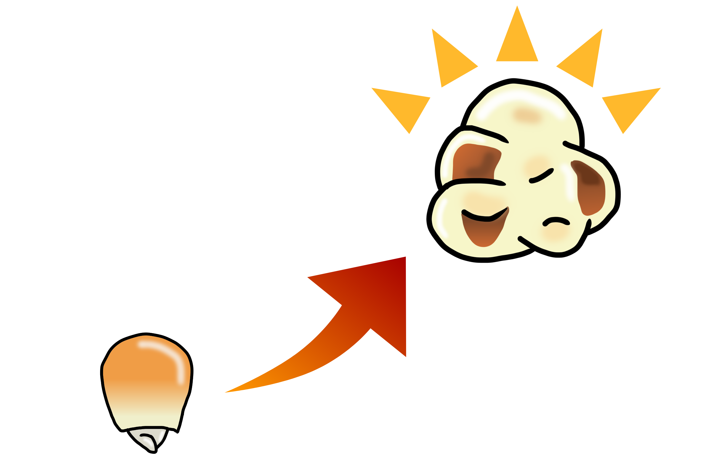

ポップコーンはクリックすると**食べることができ**、食べると満腹ゲージが溜まっていく。ただし、出来上がったポップコーンを加熱しすぎてしまうと、**焦げて消えてしまう**。

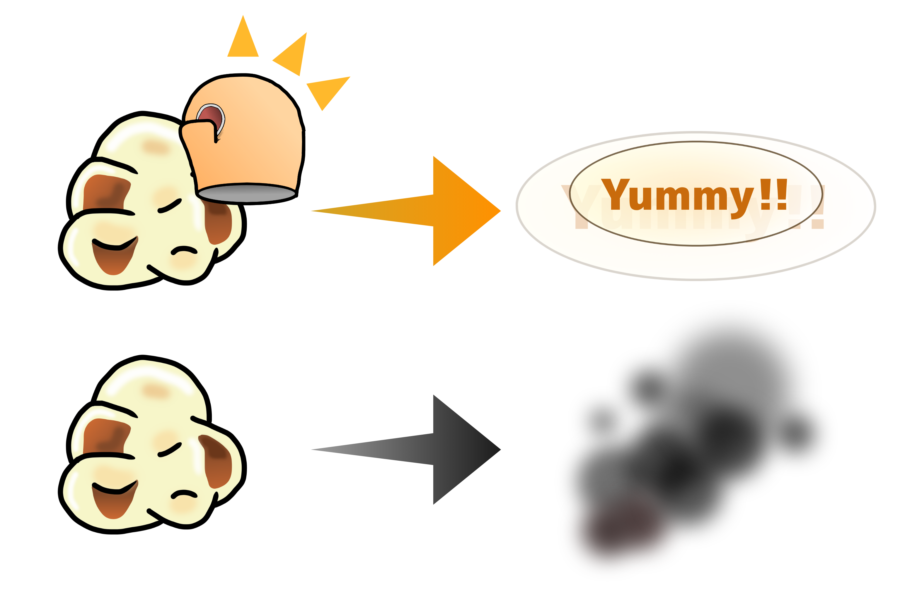

コンロの「弱」「中」「強」ボタンを押すと、**コンロの火力を調節できる。** 豆はコンロの火力が強いほど、コンロの底面に近いほど早く加熱される。

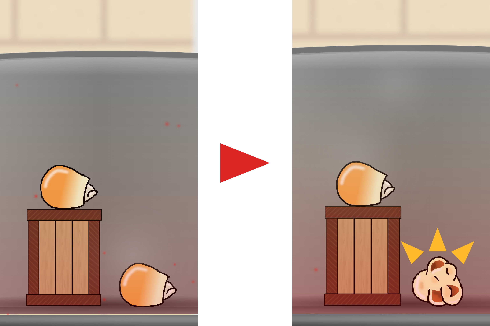

## 2. 豆の種類

豆にはいくつか種類があり、それぞれの効果はこんな感じ。

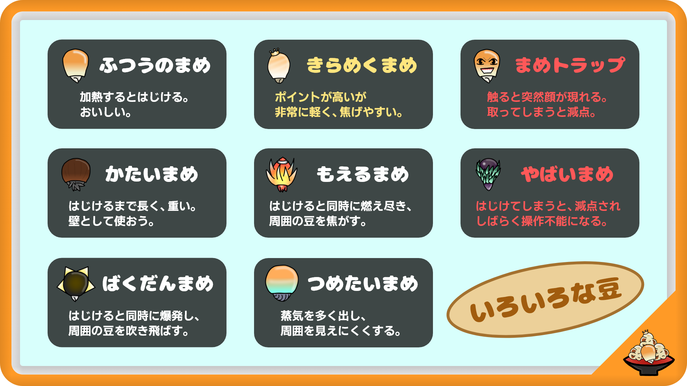

## 3. 豆の送り合い

豆やポップコーンを**上側の画面外に出すと、相手側へ送られる。** つまり、「ぶきみなまめ」や「なぞのまめ」は、「ばくだんまめ」を使って…

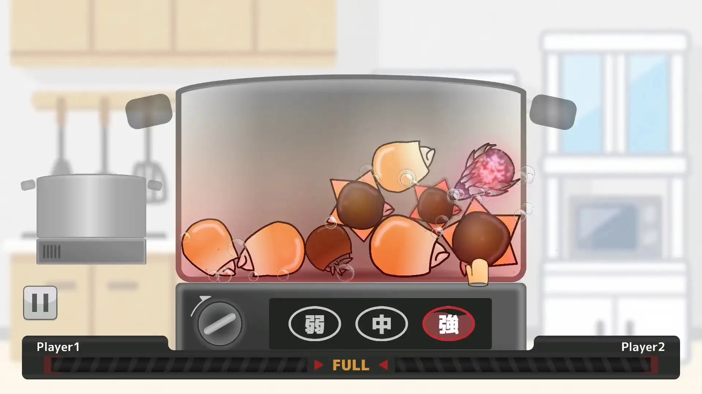

相手側へ吹き飛ばしてしまおう！

下側の画面外に出た豆やポップコーンは、そのまま廃棄される。

## 4. 注文

ポップコーンを3個食べるごとに、**画面右側に注文パネルが出現する。** 欲しい豆やアイテムをクリックすると、選択したものが画面上から降ってくる。選べるアイテムはランダムで、**豆のほかに「フタ」を注文することができる。** フタは一定時間鍋の上側をふさぎ、他の豆が鍋の中に落ちないようにできる。

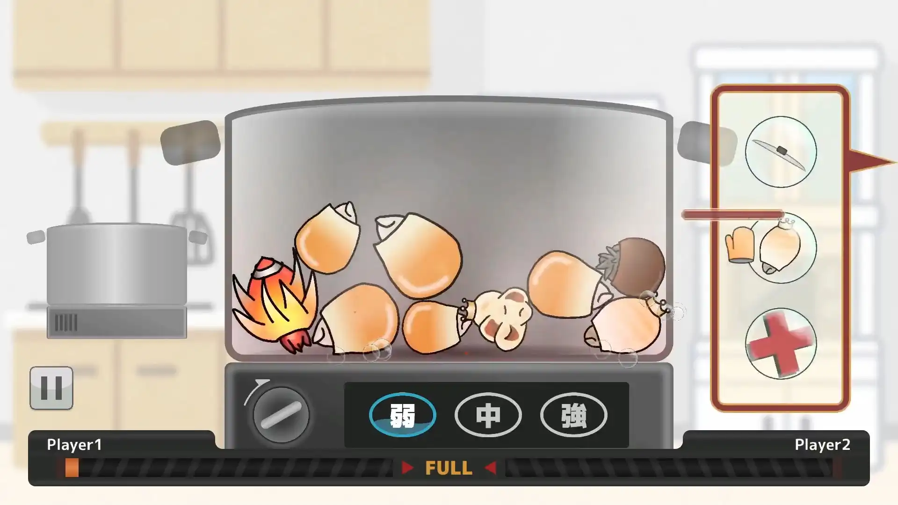

## 5. イベント

ゲーム中、**不定期でイベントが発生する。** 発生するイベントは、これらからランダムで抽選される。

* 「きらきらラッシュ」： きらめくまめが全プレイヤーに3個ずつ降ってくる。
* 「ばくだんラッシュ」： ばくだんまめが全プレイヤーに3個ずつ降ってくる。
* 「あつあつラッシュ」： もえるまめが全プレイヤーに3個ずつ降ってくる。
* 「危険物に注意！」： やばいまめが全プレイヤーに1個ずつ降ってくる。
* 「ご注文はなんなりと！」： 一定時間、全プレイヤーが注文し放題になる。

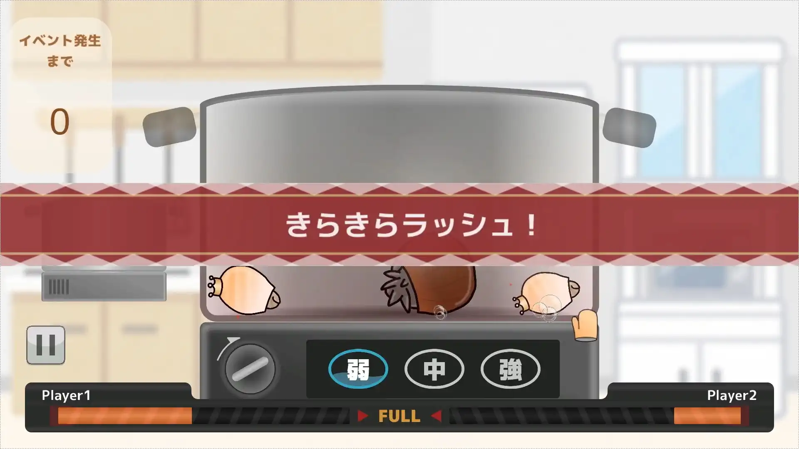

## 遊び方

①スタート画面で「はじめる」をクリックする

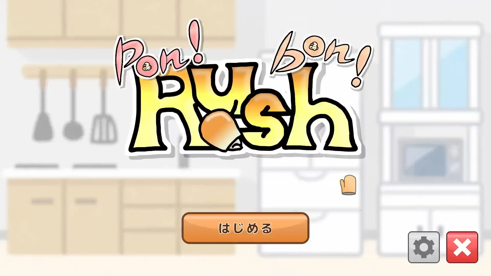

②ロビー画面へ移動するので、左下欄にプレイヤー名を入力する

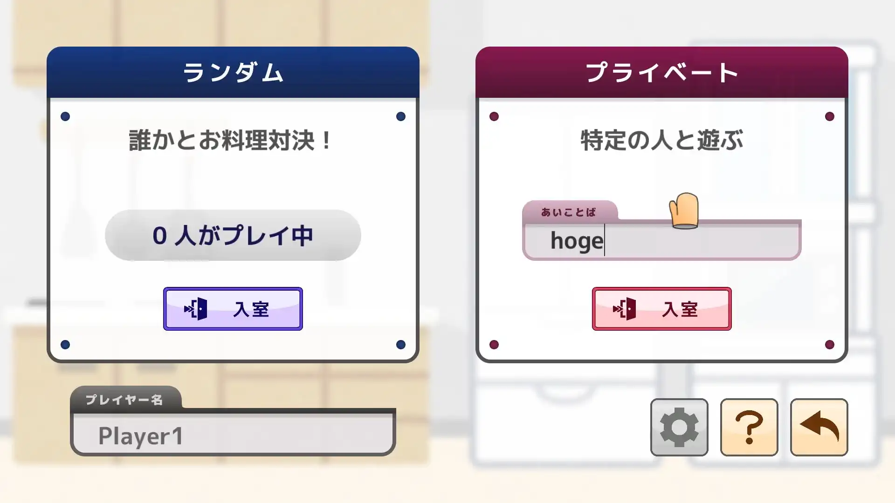

③部屋を作成、または部屋に参加する

* **誰かと遊ぶ**場合、「ランダム」の入室ボタンをクリックする
* **特定の人と遊ぶ**場合、「プライベート」にあいことばを入力し、入室ボタンをクリックする

---

④マッチング画面に移行するので、対戦相手が現れるまで待つ

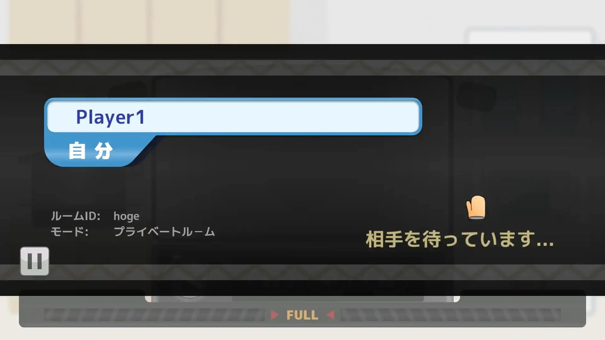

# 思い出

## はちゃめちゃな画を想像した

*2020.01.09*、「土台にものを積み上げてバランスを取るゲームで、積み上げるものを弾けるポップコーンにして、土台を鉄板にしたら、**はちゃめちゃな画が生まれそう**」という想像から、この作品は突然発生した。もともと構想があって組み上げたものではなく、**素早く完成させて次へ移るつもりだった。**

当初は、**現在に比べてゲームシステムがかなり違うもの**で、2人のプレイヤーが、同じ鍋に対して交互に豆を配置していく**ターン制ゲーム**になってた。

- 自分のターンになると左のパイプに5個の豆が出現するので、それを好きなだけ**鍋の上空に配置できる**。このときに、コンロの火力も選択しておく。
- 10秒経過すると豆の配置は締め切られ、豆が自由落下していき鍋の中が10秒間加熱される。
- プレイヤーは豆を落とすことしかできず、**鍋の中にある豆は移動できない。**
- 出来上がったポップコーンは、自分のターン中のみ食べることができる。
- 先に満腹ゲージが最大になったほうが勝ち。

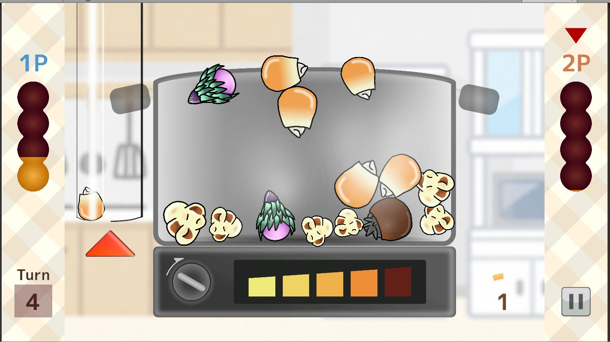

でも、この頃から**豆の種類はあまり変わっていない**。

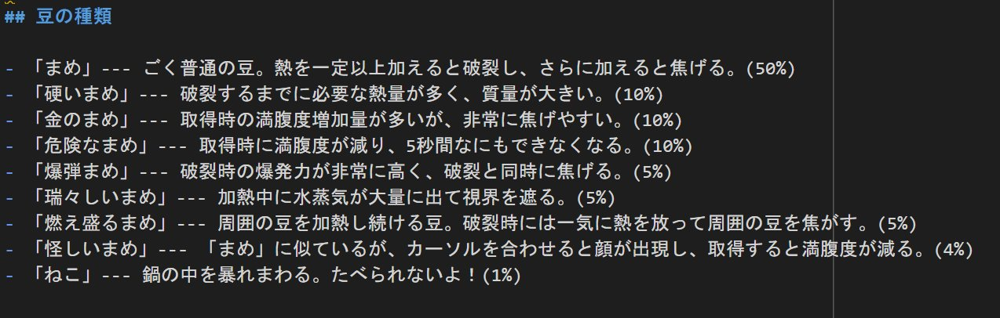

*2020.03.13*、現在のリアルタイム対戦型ゲームに変わった。

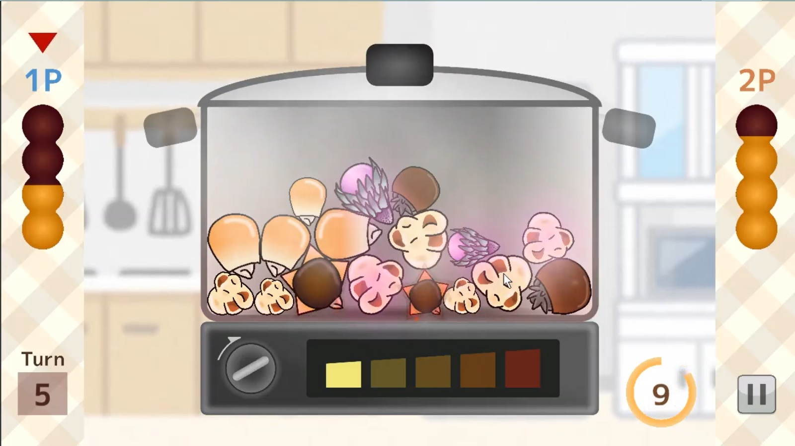

## 一度きりの完成

*2020.04.05*、**作品として遊べる状態で公開された**。この時の作品名は「Pon! Bon! Rush」で、現在公開されているのはこの時点のもの。

ここで終わりなら良かったんだけど、この子はここから最悪な道を進むことになる。

## 正しさの犠牲に

一度目の完成後から、この子は**実験台**となった。**正しく作品を作りたいという欲望**が抑えきれず、どんな組み立て方をしたらいいかを突き詰めるために何度も何度も作り変えられた。

その過程でも一応、目に見える変化もあった。これはリザルト画面。**空腹ゲージがポイント制**になり、完成時のものから大きく変わった。

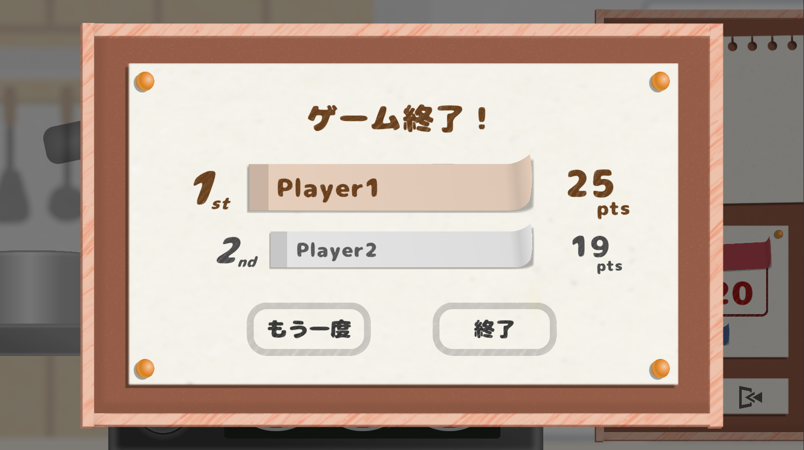

「やばいまめ」は、**破裂時に画面のすべての豆を「ゾンビまめ」に変化させる**ようになった。画面右側にコルクボードが出現したりと、ゲーム画面にも更なるこだわりが加えられた。

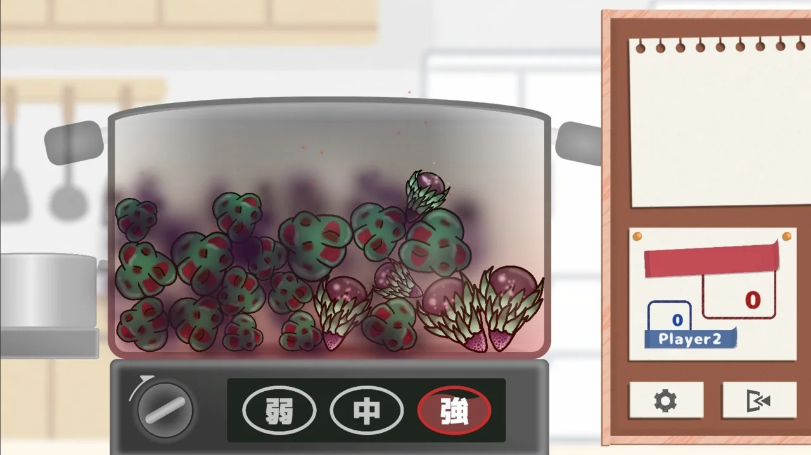

この画面は、正しさを神経質に追い求め過ぎた結果、考えるだけでもおぞましいくらい煩雑な作り方をされてる。

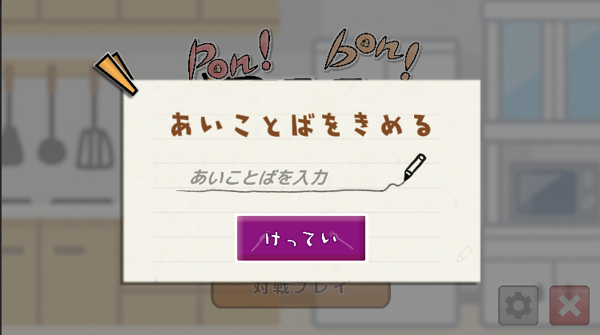

*2020.09.30*、他の作品を組み上げる必要があったという理由で、この子は**滅茶苦茶にされた状態で放置された**。

## 面白くないと感じた瞬間

*2021.03.xx*（1年後）、[メイジ・シミュレータ](/materials/mage-simulator)の放棄後、この子は**ここまで手を付けたのにもったいない**という理由で、もう一度作り直されることになった。

まず、作品のタイトルが「ポップコーン職人」に変化した。

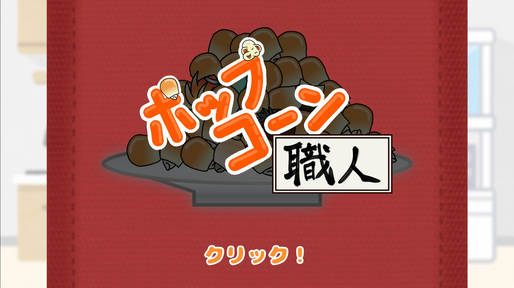

ゲームメニューは冷蔵庫を模したデザインになった。この作品には**新たに、3つのゲームモードが作られた**。

- 「お手前披露」  
  決まった順番で豆が降ってきて、高いスコアを目指す1人用モード。
- 「料理対決」  
  今までと同じ2人対戦モード。ただし、少し変わった部分もあって、豆の出現がウェーブ制になってたりした。
- 「たまご用心」  
  1個のたまごが孵化するまで、降ってくるポップコーンから守り続ける1人用モード。たまごを一気に熱しすぎ or 長時間冷ましすぎでゲームオーバーになる他、強い衝撃を与えてもアウト。

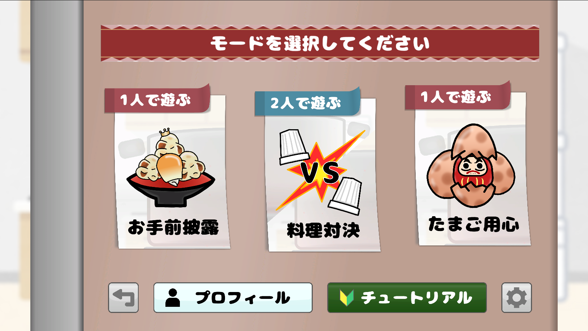

「お手前披露」を選ぶとこんな画面に飛び、挑戦するパックを選択できた。それぞれのパックには「ばくだんまめ、もえるまめが大量に降ってくる」「降ってくる豆のサイズが巨大になる」などの特徴があった。

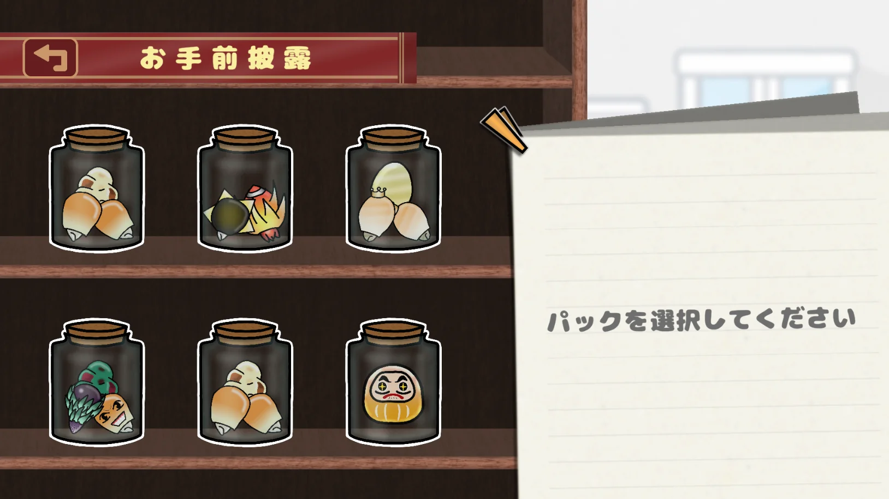

ゲームシステム自体が独特だったから、**チュートリアルが追加された**。

<iframe src="https://www.youtube.com/embed/oC7iZT5FI8Q" title="YouTube video player" allow="accelerometer; autoplay; clipboard-write; encrypted-media; gyroscope; picture-in-picture" allowFullScreen></iframe>

*2022.03.28*、ここまで1年以上ずっと手を加えてきたのに、[エライさんbot](/materials/marvelous)の着手と同時に **「このゲーム、面白くない」と言われ、この子は置き去りにされた**。用意された豊富なゲームシステムや素材などは、活かされることがなかった。

今まで、こんな酷く見捨てられたことはなかったと思う。この子は、突発的な興味で生み出され、目先だけの欲望で滅茶苦茶にされ、身勝手な都合で打ち捨てられた。随分とポップな雰囲気の作品だけど、その姿は素直に見られない。

## 中途半端を埋めるために

*2022.05.20*（2年後）、**既存作品の中途半端な部分を埋める動き**があった頃、[メイジ・シミュレータ](/materials/mage-simulator)に続いてこの作品もそのターゲットになった。

*2022.05.28*、作品本体が整備されたうえで**Web上で公開**され、**PVも公開**された。（動画制作は、このときが初めてだったらしい。）

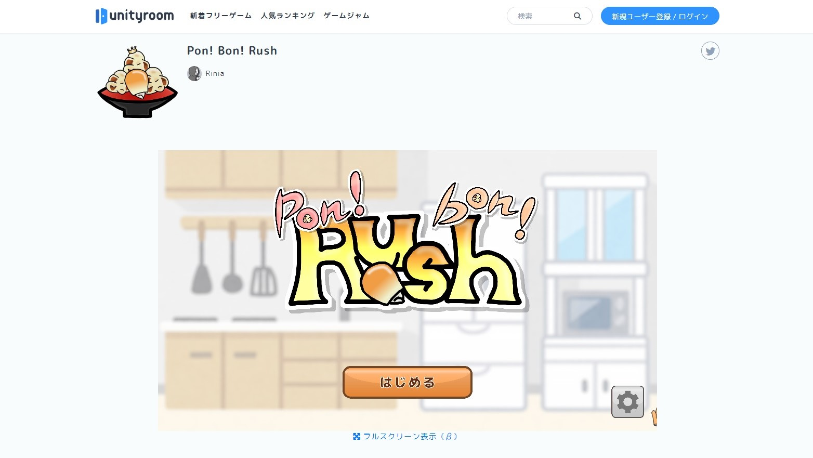

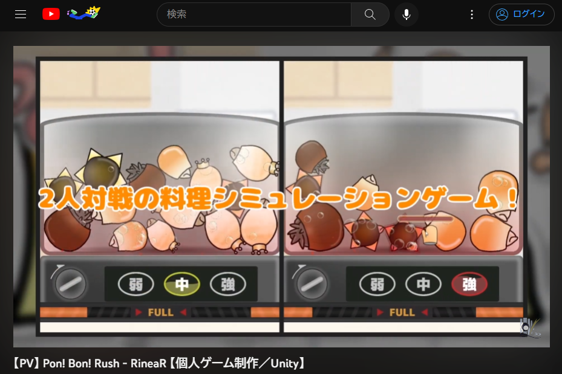

このときに「ポップコーン職人」の完成物とされたのは、最初に完成したときのものだった。理由は簡単で、**完成したのはその一度きりだった**から。それ以降ずっと、この子は完成する前にバラバラにされては組み直され、を繰り返していた。

形にならず終えてしまった子も、余力さえあれば多少なら繕うことができる。一度形として残り続けさえすれば、時間が経っても失くさないで済む。失くした子への後悔は、いくら嘆いても消えないからこそ、「完成させること」が大事なんだと思う。

一番望ましいハッピーエンドは、立派になるまで見送ることだと思うけれど。

