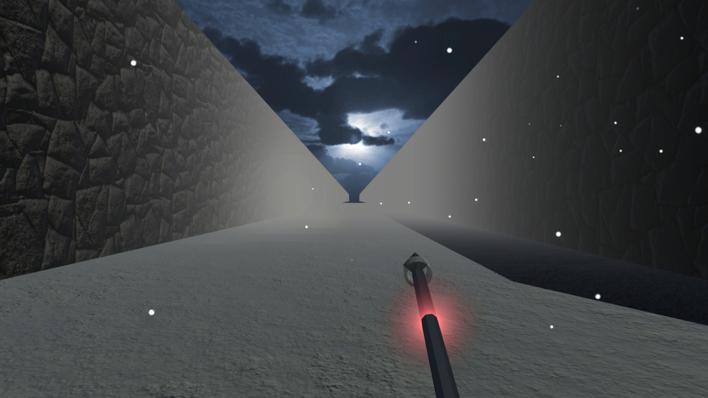
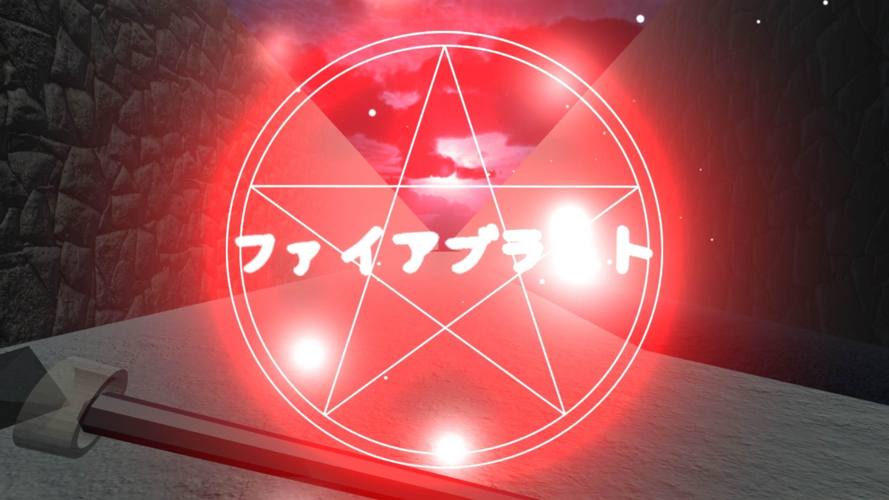
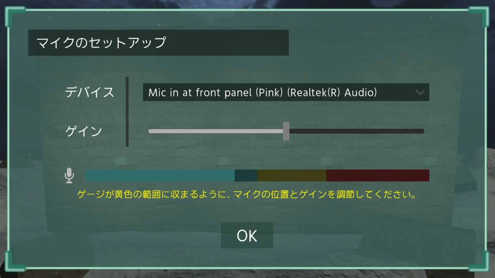
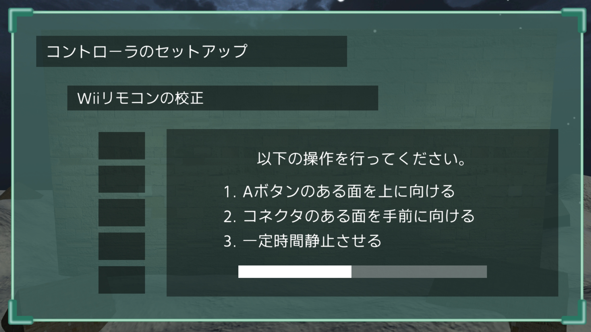
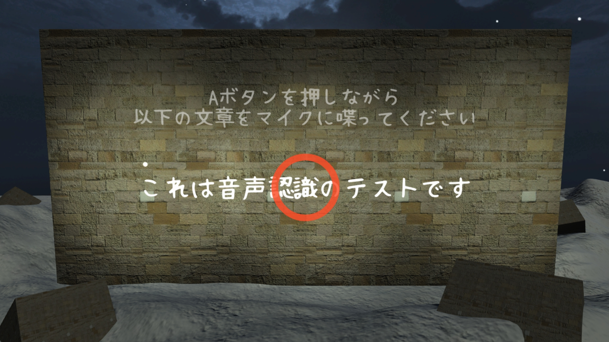
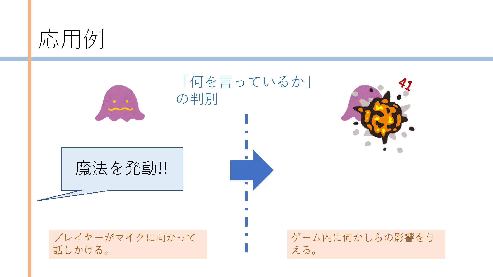
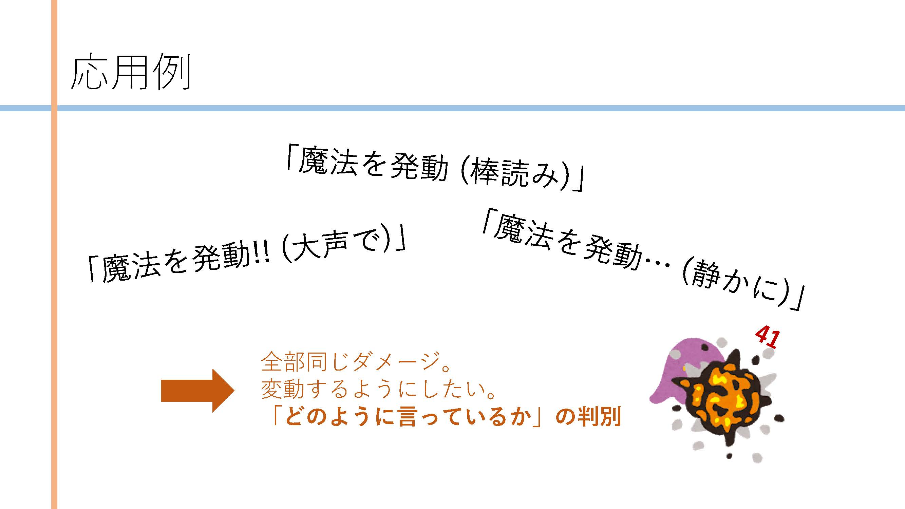
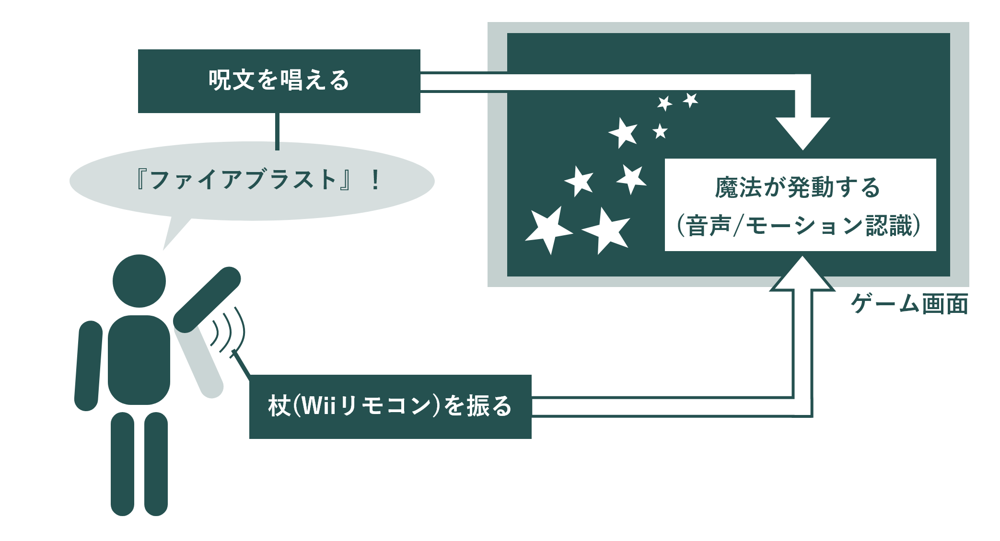
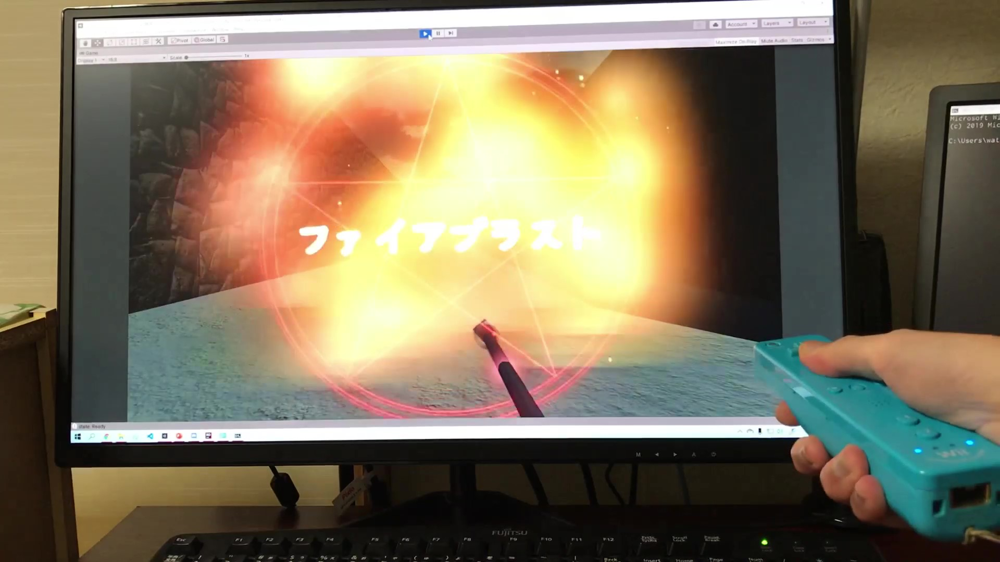

# 現在の形

<iframe src="https://www.youtube.com/embed/gBHHT_64NUg" title="YouTube video player" allow="accelerometer; autoplay; clipboard-write; encrypted-media; gyroscope; picture-in-picture" allowFullScreen=""></iframe>

今回は、**「呪文を唱えて杖を振ることで、ゲーム内で魔法が発動できる」** みたいなのを実現した。

Wiiリモコンを杖に見立てて、特定のモーションをしながらマイクに向かって呪文を放つと、ゲーム内で魔法が発動する。

画面内にある杖はWiiリモコンの向きと連動してる。

まず、**杖を特定の向きに向けると赤・青・紫などの色に光って、この状態でAボタンを押す**と魔法陣が展開される。

* 杖を自分から見て左方向に向け、Aボタンのある面が手前に来るようにする（振り払うような動作）：**ファイアブラスト**
* 杖を自分から見て正面方向に向け、Aボタンのある面が上に来るようにする（溜めるような動作）：**レーザービーム**
* 杖を自分から見て上方向に向け、Aボタンのある面が後ろに来るようにする（高く掲げるような動作）：**メテオレイン**

これが魔法陣が展開された状態。表示された呪文をマイクに向かって話す**と、呪文の文字が点滅する。

呪文の詠唱に成功すると魔法陣が輝いて、魔法が発動可能な状態になる。この状態で**特定のモーションを行う**と、魔法が発動する。

* ファイアブラスト：杖を前方向に振る
* レーザービーム：杖を前方向に突き出す
* メテオレイン：杖を下方向に振り下ろす

表示されたものとは違う呪文を読み上げたときは、魔法が発動しない。

魔法が発動すると、こんな感じ。

---

セットアップの工程も作ってある。

タイトル画面から進むと、まずは**マイクのセットアップ**。ここで、使用するマイクを選択し、音声の入力感度を調整する。

次に、**Wiiリモコンをセットアップ**する。4回ほど指定の向きでWiiリモコンを静止させ、内部に搭載されているジャイロセンサを校正していく。

次に、**音声認識が正常に行われるかどうかをテスト**する。WiiリモコンのAボタンを押しながら、画面に表示された文章を話すことで、正しく認識されることをチェックする。

これが完了すると、実際に魔法を詠唱する画面に移行する。

# あらすじ

## (1) *2019.12.xx* ／ 発想

この「メイジ・シミュレータ」のアイデアが浮かんできたのは、***2019.07.xx***。その頃にしばらくずっと、**ゲーム内でリアルに魔法を詠唱したいな**っていうことをぼんやり思ってた。

そして、ちょうどその頃に自由に研究ができる機会に巡り合った。

そこで、**モーションとか唱え方によって、魔法の強さが変わったりしたら面白いな**と思って、魔法詠唱のための音声解析を研究しようとした。

そうして自前データを収集したり、デモンストレーションをするために作られたのがこの「メイジ・シミュレータ」の始まり。

本来は、このアプリケーションを使って**みんなの「本気の詠唱」と「棒読み」の音声データを収集し、その違いを解析してゲームに組み込む**つもりだった。

作品を展示する機会もあるし、大きなスクリーンを使って、**杖を振って魔法を唱え、迫りくる敵を撃ち落とす3Dシューティングゲーム**を作りたい。

「唱えるのが恥ずかしい！」っていう問題も、窓が割れるくらい大音量のBGMと、一緒に呪文を唱えてくれるナビゲーション音声があれば大丈夫な気がした。

## **(2) *2020.12.xx* ／ 無理**

そう思った矢先、様々な不運が重なって、研究がまともに出来ない状態になった。 けれども、**音声認識とモーション認識だけを残して、せめてゲーム作品にしよう**とは思った。

でも、不都合に不都合が重なって結局、今の「魔法が唱えられるだけ」の形までしかたどり着けなかった。

ちなみに、なぜ杖にWiiリモコンを使っていたのかというと、それしかなかったから。 

本当はNintendo SwitchのJoy-Conが欲しかったんだけど、高くて手が出ない。そこで、手元にあるWiiリモコンとヌンチャクでどうにかゲームを作ろうとした。けど......これもまた大きな壁が立ちはだかって、締切の関係上「無理」と思って、断念した。

締切が過ぎた後は、当プロジェクトについて考えることに疲れてしまったのか、作るのをやめてしまった。**魔法使いにはなれなかった。**

## **(3) *2021.02.15* ／ 成れの果て**

というところで、**手元には「Wiiリモコンとマイクで魔法が唱えられるもの」だけが残ってる。**

それでも、これが今後どう影響を与えて、何のきっかけになるかは分からない。魔法使いにはなれなかったけど、またいつか、今度はみんなを魔法使いにできたらいいな。

