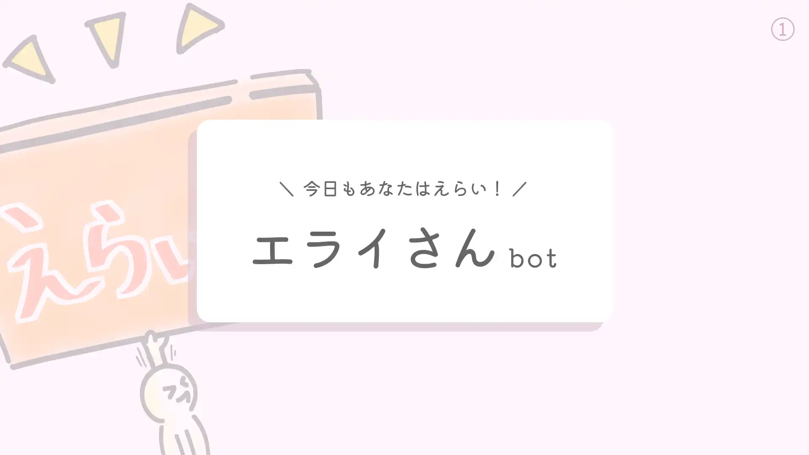
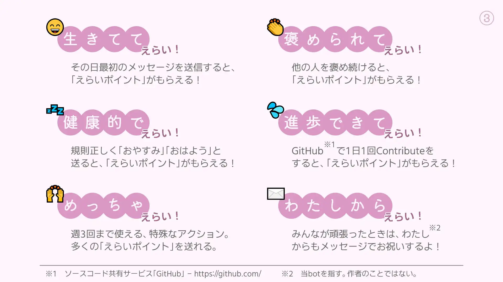
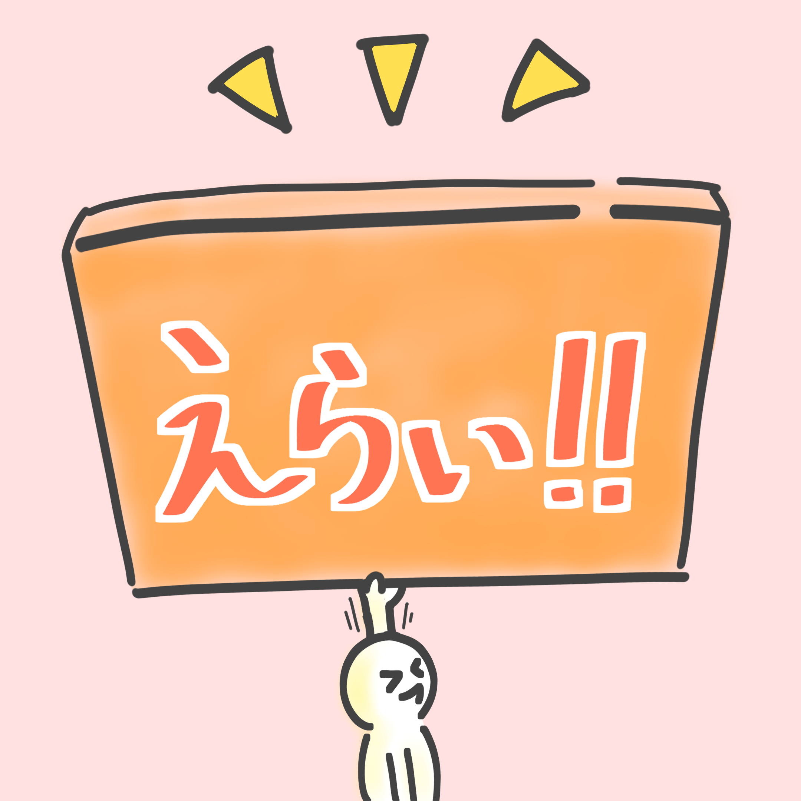

# 現在の形

## パンフレット

## 説明書

えらいポイントは、**あなたの行動の「えらさ」を表すポイント**。毎週月曜4:00にリセットされ、それまでの1週間でのランキングが発表される。

他人のメッセージに👏 のリアクションを付けることで、**相手を褒めることができる**。褒めた相手には、えらいポイントが付与される。

他人のメッセージに🙌 のリアクションを付けることで、**相手を「めっちゃ」褒めることができる**。褒めた相手には多くのえらいポイントが付与される。

ただし、一週間当たりの使用回数には制限があり、何回も送ることはできない。

他ユーザーのメッセージに💩 のリアクションを付けることで、相手を咎めることができる。これは褒めるのとは逆で、相手のえらいポイントが減少する。

毎日、**最初のメッセージを送信したとき**にえらいポイントが付与される。

**他人をたくさん褒める**と、自分にもえらいポイントのボーナスが貰える。

反対に、他人を何回も咎めていると、自分にもえらいポイントのペナルティが与えられる。

エライさんbotは、自分のGitHubのアカウントを紐づけることができ、**毎日プロジェクトを更新する**とえらいポイントのボーナスが貰える。

**1時までに寝て12時までに起きる**ことで、えらいポイントのボーナスが貰える。ただし、1～5時にチャットを送ると、ボーナスがキャンセルされる。

# あらすじ

## (1) *2019.04.xx* ／ 発案

この作品の元となったのは、**何かを達成したことを褒め合うSNS「Straight」** 。*2019.04.xx*から制作を試みたが、当時の能力不足により完成にはたどり着けず、*2019.07.xx*に挫折した。

それ以降、「Straight」は書き留められていたものの、その実現にはもはや興味がなくなっていた。

## (2) *2021.03.29* ／ コミュニティの中で

botの利用が活発だったコミュニティに所属していたとき、**頑張ったことを記録し褒めてくれるbot「エライさんbot」を作り始めた**。これは自然と発想が浮かび上がったもので、かつての「Straight」と何も関係がなかった。

そして、*2021.04.12*に「エライさんbot」は試験的に一日だけ導入された。その後*2021.04.30*、仮導入。この時からこの子は毎日24時間稼働し続け、**コミュニティのみんなから親しまれていった**。

*2021.05.03*、エライさんのアバターが描かれた。

*2021.05.28*、**正式にリリースし、現在の形になった**。毎週初めに「ランキングを表示・ポイントをリセット」するようになったのに加え、「毎日、ちょっとずつ進歩する」「健康な睡眠を取る」のボーナスが追加された。

## (3) *2022.07.25* ／ 軸

この子は、**コミュニティ脱退に付き稼働を停止した**。それまでの期間、この子はbotながらも、コミュニティの一員として馴染んでたようだった。

**この子が「Straight」の後継なんじゃないかと思い始めたのは、稼働終了後**。アイデアノートを整理してた時、本来「Straight」で叶えたかった光景が、閉じたコミュニティ内限定ではあるが、「エライさんbot」によって叶えられていたことに気付いた。

この子を組み上げ始めたときには、「Straightをここで再現しよう」なんて思ってなかったから、奇跡は凄いなって思った。
