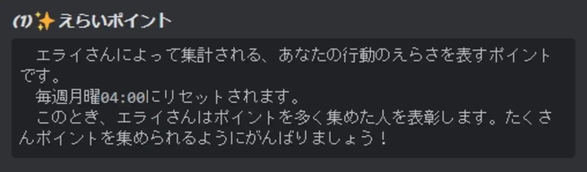
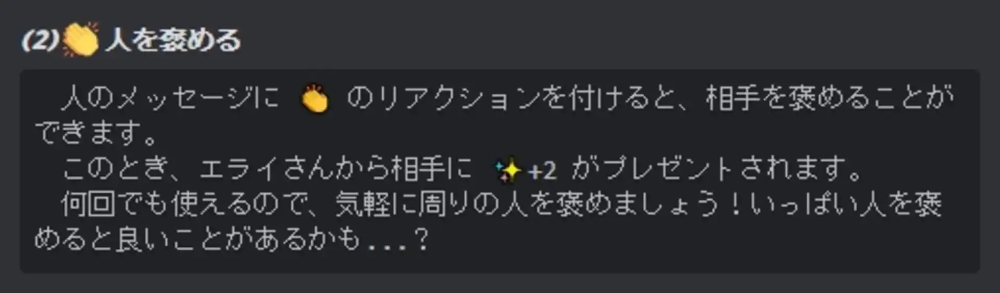
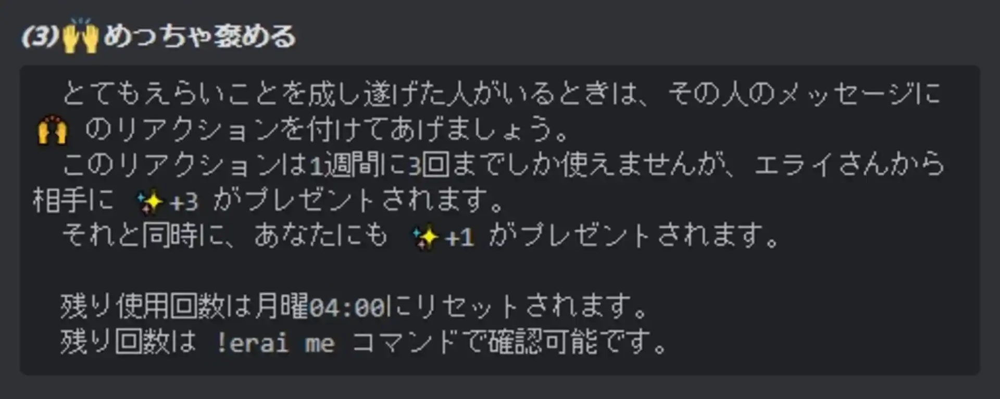
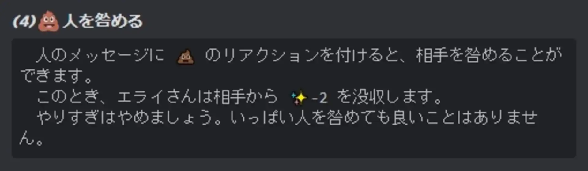
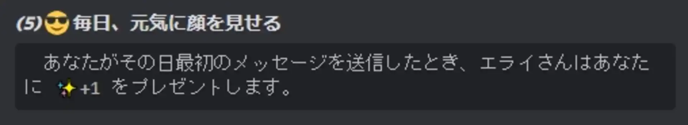
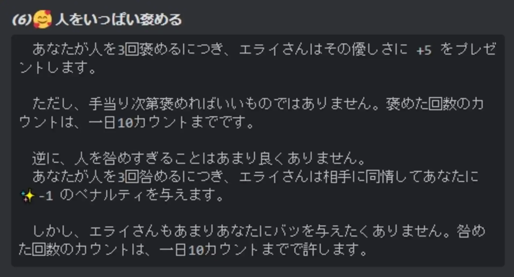

# 現在の形

えらいポイントは、あなたの行動の「えらさ」を表すポイント。毎週月曜4:00にリセットされ、それまでの1週間でのランキングが発表される。

他人のメッセージに👏 のリアクションを付けることで、相手を褒めることができる。褒めた相手には、えらいポイントが付与される。

他人のメッセージに🙌 のリアクションを付けることで、相手に特殊な褒めるアクションを送ることができる。褒めた相手には多くのえらいポイントが付与される。

ただし、一週間当たりの使用回数には制限があり、何回も送ることはできない。

他ユーザーのメッセージに💩 のリアクションを付けることで、相手を咎めることができる。これは褒めるのとは逆で、相手のえらいポイントが減少する。

毎日、最初のメッセージを送信したときにえらいポイントが付与されます。

他人をたくさん褒めると、自分にもえらいポイントのボーナスが貰える。

反対に、他人を何回も咎めていると、自分にもえらいポイントのペナルティが与えられる。

エライさんbotは、自分のGitHubのアカウントを紐づけることができ、毎日プロジェクトを更新するとえらいポイントのボーナスが貰える。

1時までに寝て12時までに起きることで、えらいポイントのボーナスが貰える。ただし、1～5時にチャットを送ると、ボーナスがキャンセルされる。

# あらすじ

## (1) *2019.04.xx* ／ 発案

この作品の元となったのは、何かを達成したことを褒め合うSNS「Straight」。

このアイデアは*2019.04.xx*から制作を試みたが、当時の能力不足により完成にはたどり着けなかった。

## (2) *2021.04.xx* ／ 制作開始

