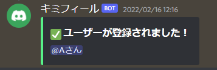
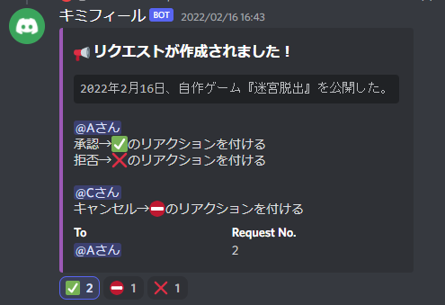
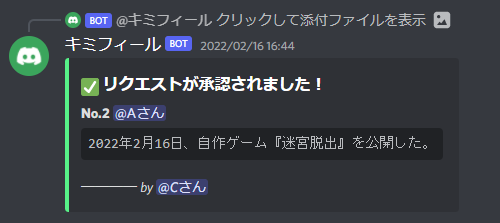
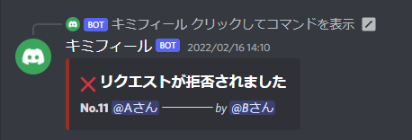
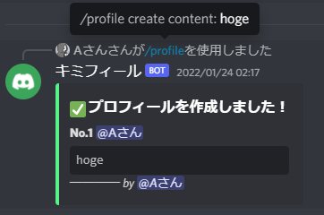
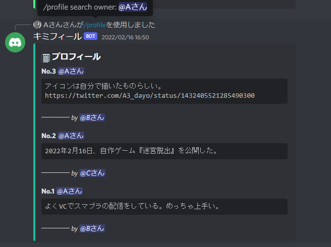
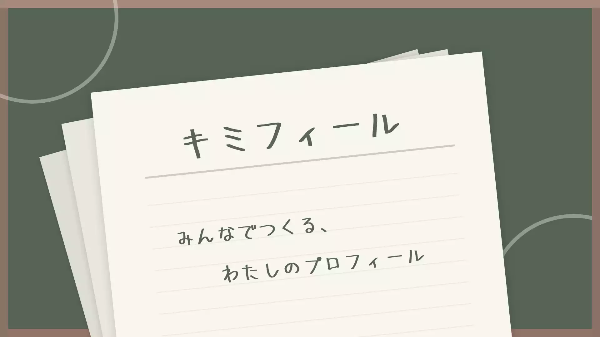

# 現在の形

すべての機能は、[ガイド](https://kimifile.notion.site/473ae50d379048a39fe76437bf1c4b1c)に載ってる。

「キミフィール」とは、他の人に自分のプロフィールを書いてもらえるサービス。 **誰でも気軽に作れて、気軽に内容を書き合えるwiki**をイメージした。

プロフィールを書いてもらう流れは

1. 自分のプロフィールを誰かが書いてくれる
2. 送られてきたプロフィールをチェックし、承認 or 却下 を決定する
3. 承認すれば、自分のプロフィールの一部となる

といった感じ。不都合な内容を載せられると困るから、**送られてくる内容をチェックできるようにした**。

## 使い方

まずは、**ユーザー登録をする**必要がある。指定されたコマンドを1つ入力することで、キミフィールが使えるようになる。

コマンドから、**他人のプロフィールを書く**ことができる。書いたプロフィールは相手に送られ、承認待ちになる。

送った相手が✅を押すと**承認**され、プロフィールとして追加される。

送った相手が✖を押すと拒否されるので、書かれたくない内容がプロフィールに載るのを防ぐことができる。

**自分のプロフィールを書く**こともでき、その場合は即座に反映される。

書かれたプロフィールは、**全員が見ることができる**。見たいプロフィールを「○○さんが書いたもの」「○○さんのプロフィール」などの条件で絞れるほか、完全にランダムで表示することもできる。

# 思い出

## 挫折を繰り返したアイデア

いろんな活動者についてのwikiをふと眺めていて、 **「周りの人々のエピソードやプロフィールをSNSから引っ張って書いたりする文化が、そこら中であったら面白いのに。」** と思ったのが始まり。

*2020.08.29*（2年前）、[ポップコーン職人](/materials/popcorn-chef)を放棄する気配があった時期に、「Wrapnote」という仮の作品名で作成を試していた。しかし、**能力不足により何度も障害にぶつかり断念した**。当時は、誰でも利用できるWeb上のサービスとして公開することを目指していた。

*2020.11.23*、[メイジ・シミュレータ](/materials/mage-simulator)と並列で、今度は「シロップ」という名前でリベンジしたけど、こちらも出来上がることはなかった。

## botならば実現できる

*2021.11.27*、[RineaRの筏 chap.1](/materials/rinear-raft-chap1)を完成させたあたりの時期に、[エライさんbot](/materials/marvelous)のときと同じコミュニティで「botならばこれを実現できる」と思い、「キミフィール」という名前でbotを作り始めた。途中で一回、*2021.12.13*あたりに技術的な迷走をしたけど、そのあとはスムーズに組み上げられた。

*2022.01.30*、仮導入され、この子は毎日24時間動くようになった。しかし、[エライさんbot](/materials/marvelous)が能動的に動いていたのに対して、キミフィールは受動的だったので、**あまりコミュニティに溶け込むことは出来なかった**。

*2022.02.16*、作り方を整理し、完成として正式リリースされた。

*2022.07.25*（半年後）、[エライさんbot](/materials/marvelous)と同時にこの子も**コミュニティ脱退に付き稼働を停止した**。

今回は妥協を重ねたけれど、本来想像していたものは不特定多数の間で盛り上がってる姿。いつかこの子が、みんなの個性であふれると良いな。
