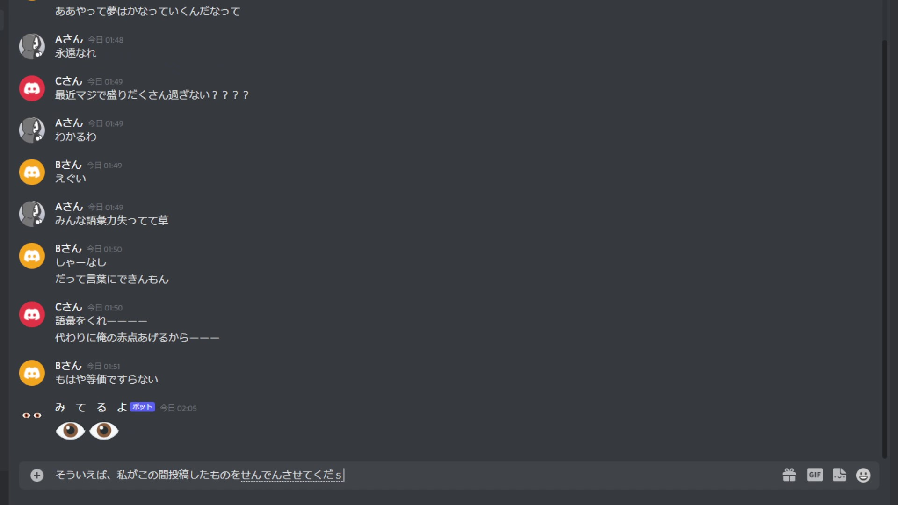

# 現在の形

<iframe  src="https://www.youtube.com/embed/Vto86ts0cQ8" title="YouTube video player" allow="accelerometer; autoplay; clipboard-write; encrypted-media; gyroscope; picture-in-picture" allowFullScreen></iframe>

# 思い出

## |柱|👁)

*2020.xx.xx*（2年前）、チャットで`○○○が入力中...`が長時間続いてることに気付いたとき、何か長考してるのかなって思ってよく「👁👁」を送ってた。そして、これを自動化しようって思ったのが始まり。

## (👁 👁)

*2022.02.25*、3時間ほどで完成した。仕組みは簡単で、**入力中を検知したら、1%で数秒後に目の絵文字を送る。** ただし、会話がにぎわってるときに送っても面白くないから、送信前に**メッセージが過去5分間送信されていないことをチェック**する。あとは名前を「み て る よ」にして、アイコンも目の絵文字にして恐怖感を醸し出したら完成。

ちなみに、今でも一生懸命みんなに対して「み　て　る　よ」ってしてくれてる。要望があったり、魔が差したりしたらみんなが自由に使えるように公開しようかな。こんなふざけた子でよければ。
