# かつての形

「RineaRの筏」は、RineaRのホームページの初期バージョン。

デザインは**全体的に暗めで、アニメーションを多用**していた。また、PC版とスマホ版でそれぞれ見え方を変えていたりと、**かなり複雑な作りをしていた。**

## Home

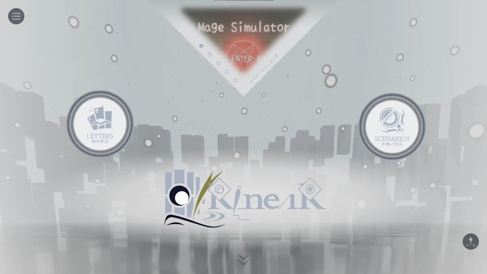

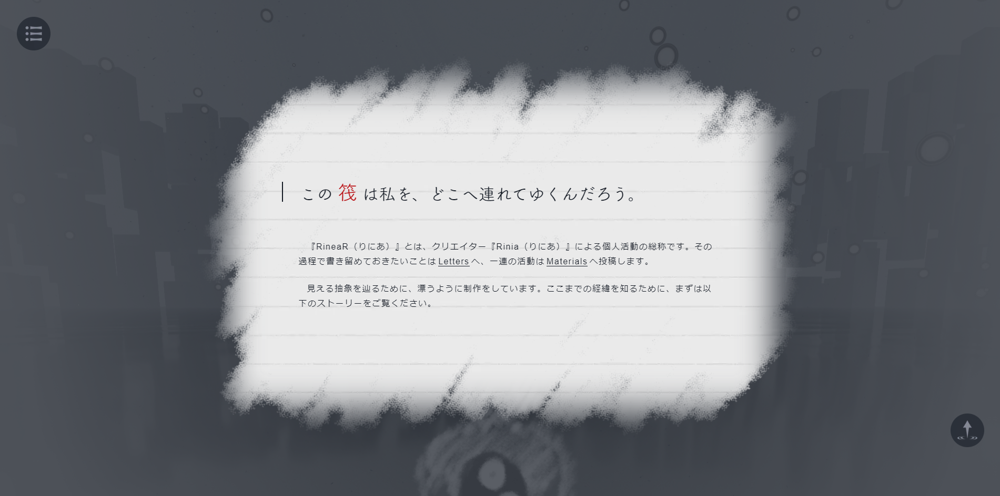

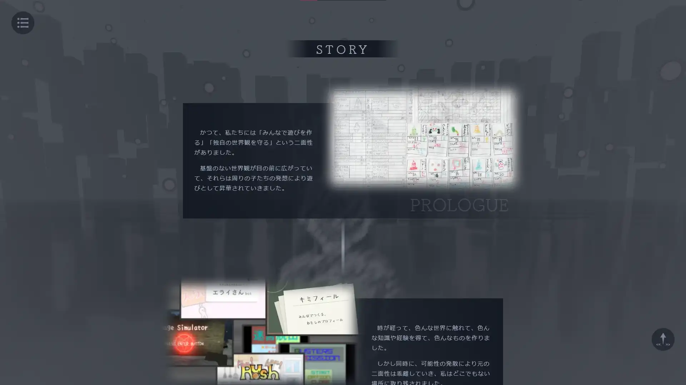

## Letters

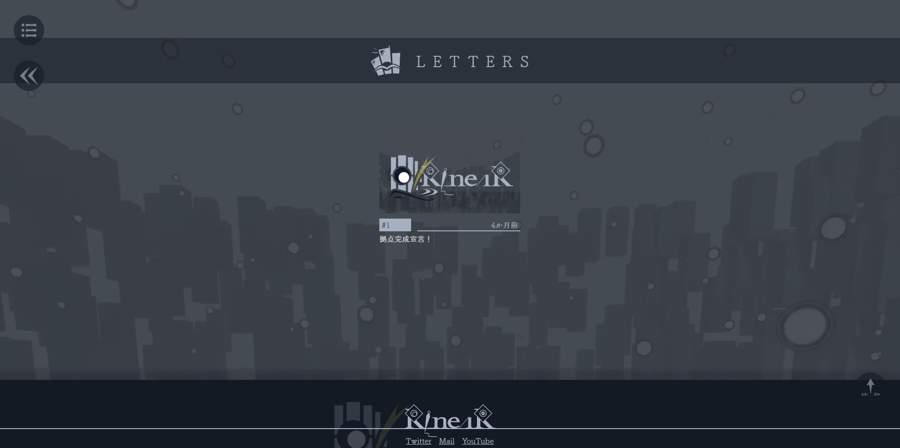

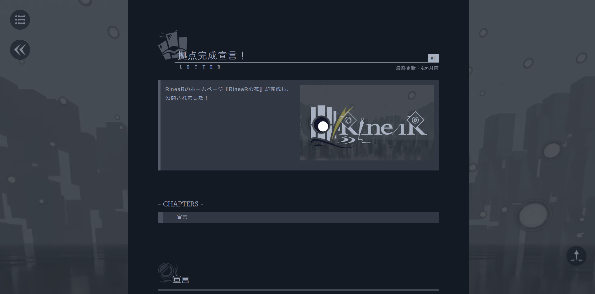

## Materials

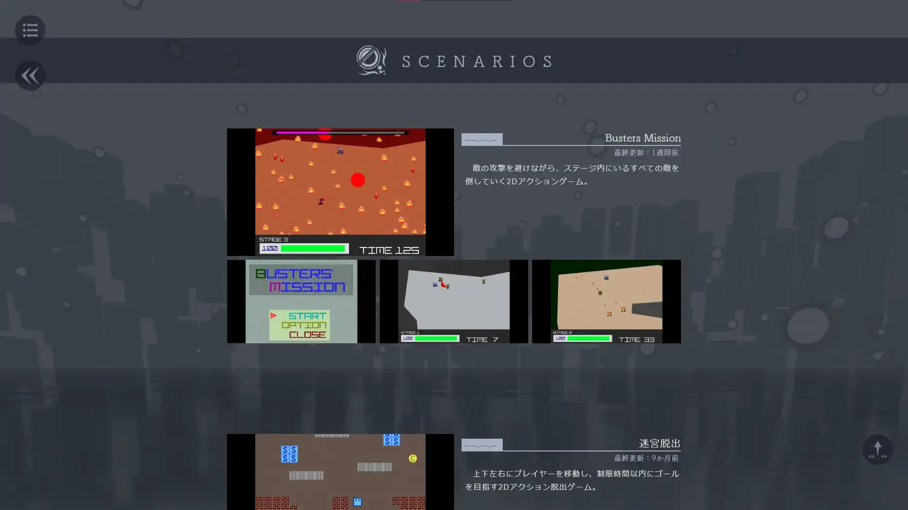

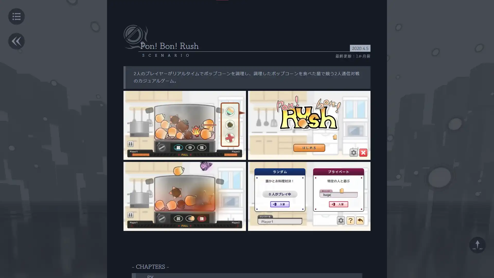

## メニュー

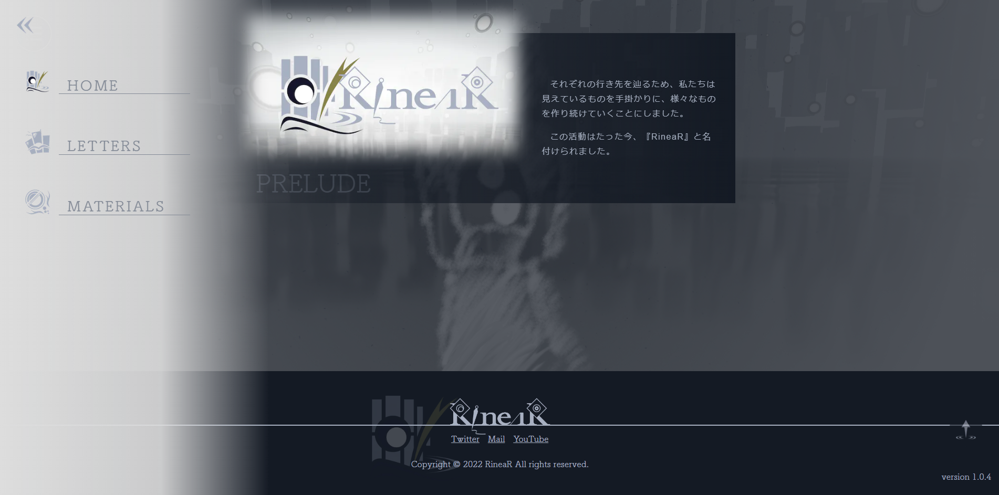

# あらすじ

## (1) *2021.05.29* ／ 構想

始まりは、[エライさんbot](/materials/marvelous)が完成し、**作品置き場が欲しい**と思うようになったことだった。

そして、**自分の世界観を表現したい、アニメーションをふんだんに使いたい**というコンセプトも、この時点で決定してた。

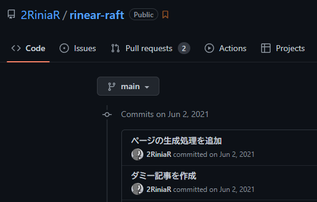

当時は、現在とは全く異なるデザインを想定してた。

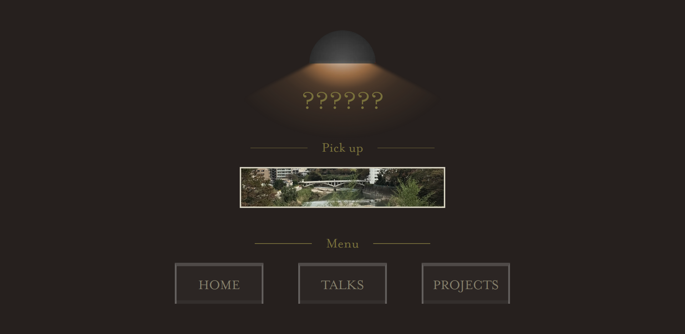

これは「ホテルにありそうなエレベーターホール」を模した、ダークなメニューデザイン。

**各ページを「階層」と捉えて、メニュー画面を開くとエレベーターでそれぞれの「階層」を行き来できる**、みたいなデザインを考えてた。各ページのデザインは「雨」をテーマにして、今よりもずっと現実に近い景色にすることを想定してた。

このデザイン案は、*2021.06.29*辺りで他のデザイン案に書き換えられ、それと同時にエレベーターを模したポータルページは削除された。

## (2) *2021.07.10* ／ 第2案

まだ未公開だったけど、この時点でホームページは一度完成させた。

当時は、現在「Letters」と呼んでいる場所が「Talks」になってて、現在「Materials」と呼んでいる場所が「Projects」となってた。どちらかというと**世界観よりも、作品置き場もとい「ポートフォリオサイト」としての役割に比重を置いてた。**

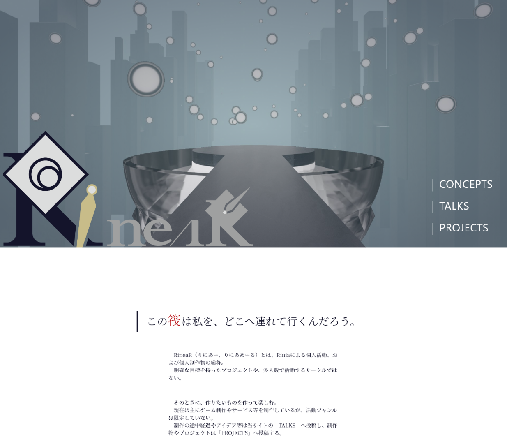

「霧の中に漂う筏で行先もなく漂いながら、数々の抽象を眺めている」という**RineaRのコンセプトアートの情景は、この頃から構想があった。** 無数に浮かんでる丸いものがその抽象で、当時は「奇想体」なんて呼んでたりした。

「RineaR」自体はこの2年前から考えていた独自概念だったけど、この段階でだいぶよく見えるようになってきたと思う。

## (3) *2021.08.15* ／ 第3案

この段階でデザインや世界観などの構想が固まってきたため、「RineaRの筏 v0.1.0」として、限定的に公開できることを目指した。

まず、RineaRのアイコンが変更された。

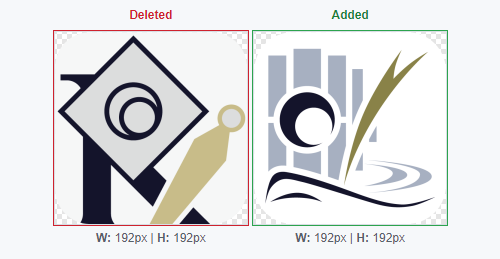

そして、現在トップページにあるRineaRのコンセプトアートは、この段階で作成された。

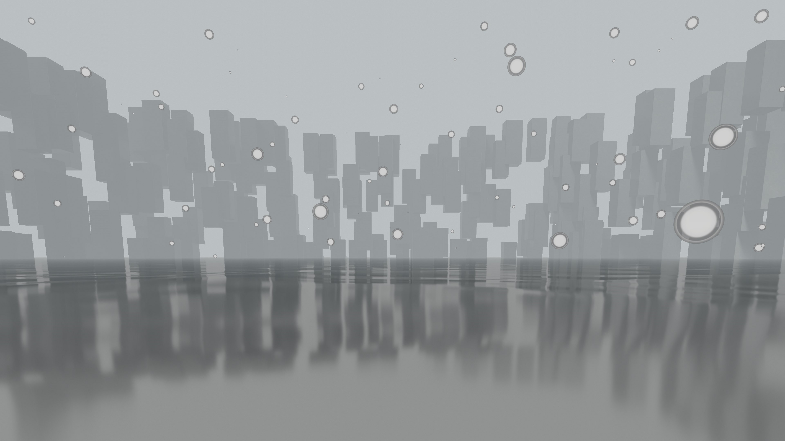

*2021.10.13* に全体が完成し、無事v0.1.0として公開された。

## (4) *2022.07.03* ／ 公開

[メイジ・シミュレータ](/materials/mage-simulator) の紹介動画作成や、 [Pon! Bon! Rush](/materials/popcorn-chef) の公開に伴い、「RineaRの筏」も公開することにした。

まだ画像だけを仮置きしていたコンテンツページも、このときに一気に書いた。

## (5) *2022.11.03* ／ 解釈の進行

「RineaRの筏」は、

- スマホで閲覧するときにカクカクするので、軽くしたい
- ページの作りが複雑で維持するのが大変なので、シンプルにしたい
- 記事を書くのに結構な労力がかかるので、簡単に記事を書けるようにしたい
- RineaRの解釈に進展があったため、コンセプトを変更したい

といった個人的な要望により、**次のバージョンへ更新された。** その内容が [こちら](/materials/rinear-raft-v2) 。

