# 現在の形

「グラスモーズ」は、1週間でゲームを作り上げる企画にて組み上げたもの。

[ここ](https://unityroom.com/games/glass_moze)からプレイ可能。

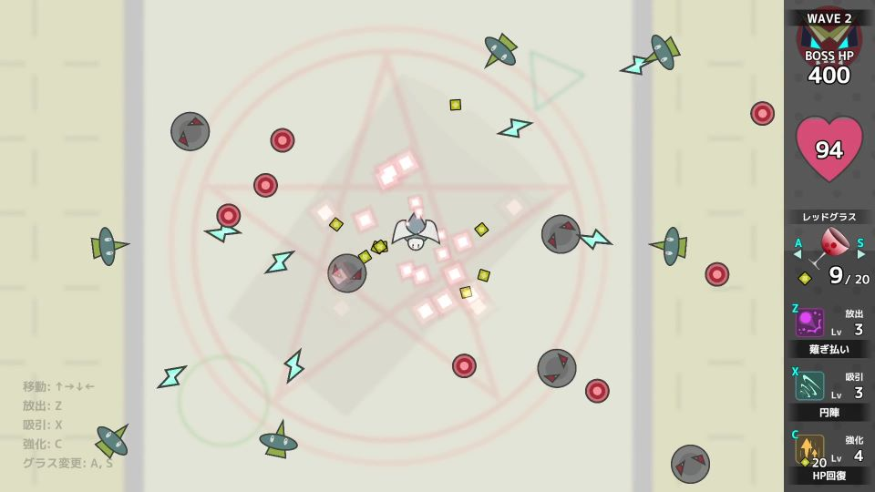

**ウェーブ制**で、カウントダウンが0になると敵が押し寄せてくる。最後に待ち構えるボスを倒すとクリア。プレイヤーのHPが0になるとゲームオーバー。

## ルール

**敵の攻撃を吸引**し、攻撃または強化に使用することで敵を倒していく。

### グラス

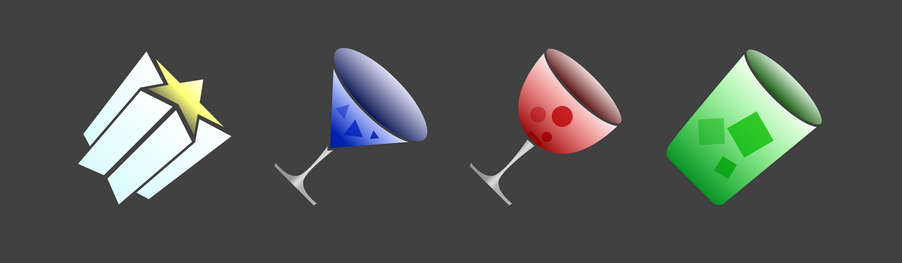

**敵の弾を吸引し、放出・強化を行う装置。** 

4種類持っており、プレイ中に何度でも切り替えることができ、**グラスの種類によって吸収・放出・強化のアクションが異なる**。また、吸収した敵の弾は各グラスごとに別々に蓄積される。

### モーズ

**敵が発射してくる弾。** グラスを使って吸収することで、放出または強化に使うことができる。

## 操作方法

- 【↑】【↓】【→】【←】：移動
- 【Z】：放出
  - **モーズを消費して、攻撃を行う。** 
  - 長押しで溜めることもでき、モーズの消費量が増える代わりに攻撃が強化される。
- 【X】：吸引
  - **敵の弾を吸引し、モーズを集める。**
- 【C】：強化
  - **モーズを消費して、プレイヤーを強化する。**
- 【A】【S】：グラス切り替え
  - 選択中のグラスを切り替える。

## グラス一覧

### グリーングラス

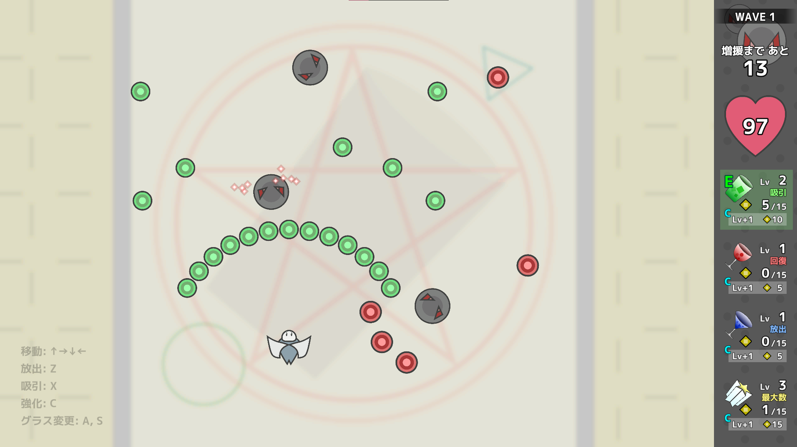

放出(Z)：**前方の広範囲**に大量の弾を発射する。

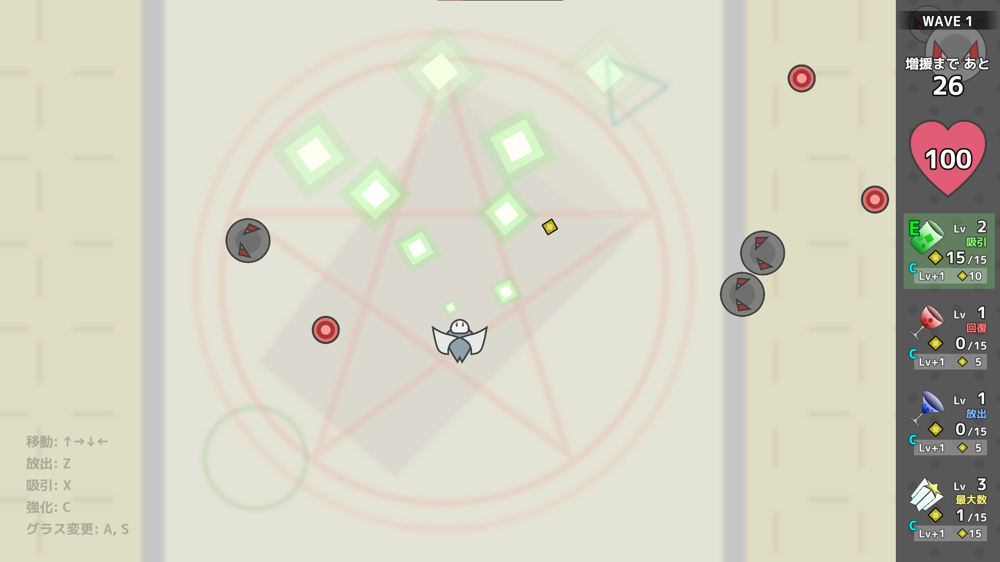

吸収(X)：**前方の広範囲**を吸い込む。

強化(C)：**吸収力**を強化する。

### レッドグラス

放出(Z)：**周囲の近距離**を爆発させる。

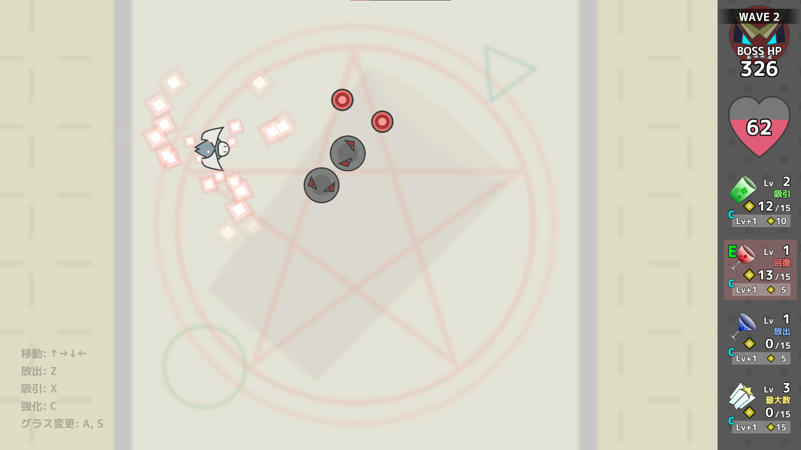

吸収(X)：**周囲の近距離**を吸い込む。

強化(C)：モーズをすべて消費し、消費した分だけ**HPを回復する**。

### ブルーグラス

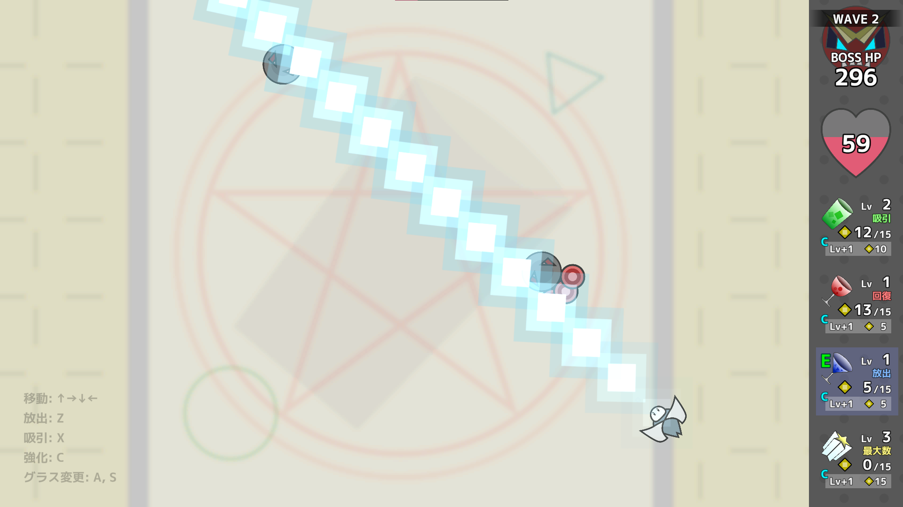

放出(Z)：前方の**直線状**にレーザーを発射する。

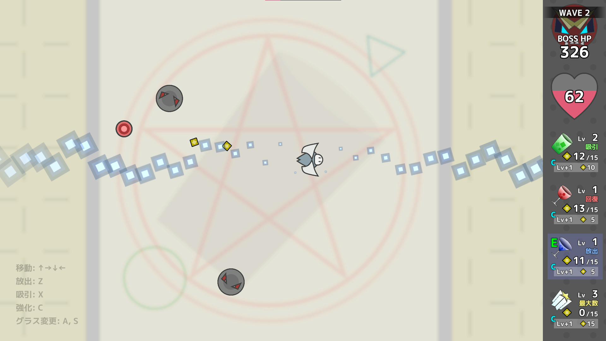

吸収(X)：**直線状**の範囲吸い込む。

強化(C)：**放出力**を強化する。

### シャイングラス

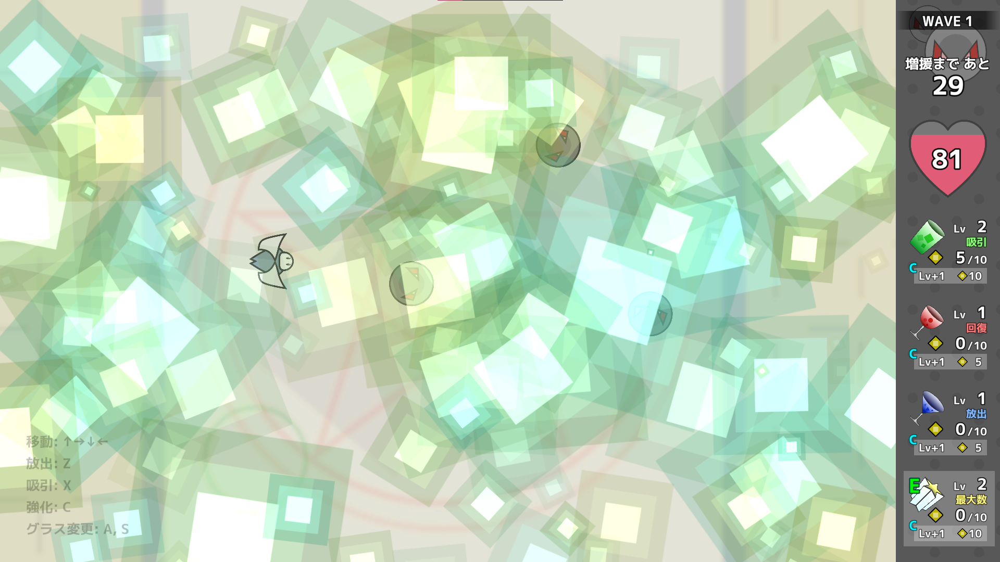

放出(Z)：**フィールド全体**を攻撃する。※モーズが最大の時のみ発動可能

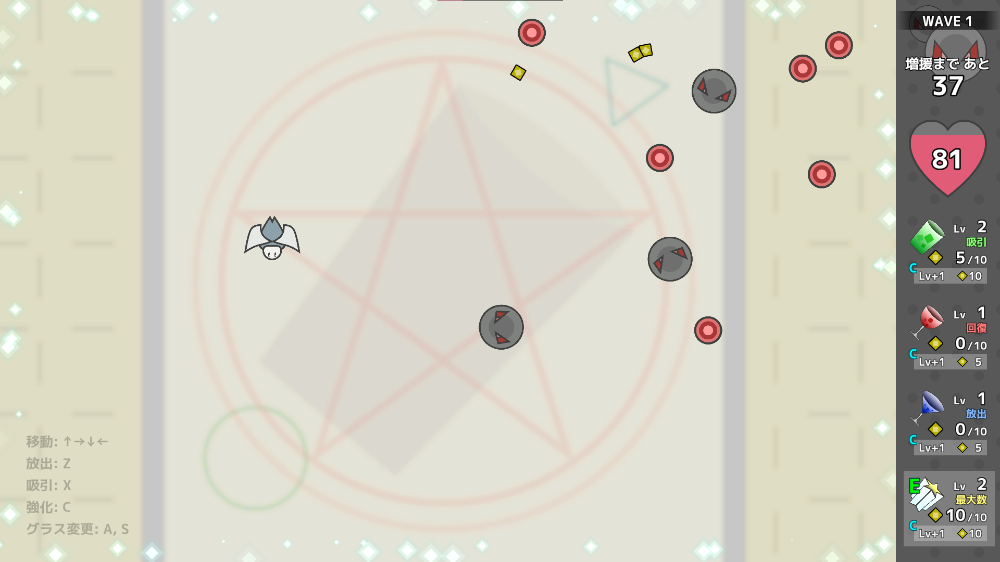

吸収(X)：**画面外**に出た弾を吸い込む。

強化(C)：**保持できるモーズの最大数**を増やす。

### 戦略

これら4つのグラスは

1. シャイングラスがモーズを吸引可能になる段階まで、**グリーングラス**で吸引力を強化する
2. **シャイングラス**で所持モーズの最大数を増やす
3. **ブルーグラス**で放出力を強化する
4. 敵が多くなってきたら放出で数を減らし、HPが危なくなったら**レッドグラス**で回復する

を繰り返すように使うことを想定している。

# あらすじ

## (1) *2022.09.05* ／ 発想

この作品は、企画のテーマを見たときに**ぱっと閃いたアイデアから**作られた。

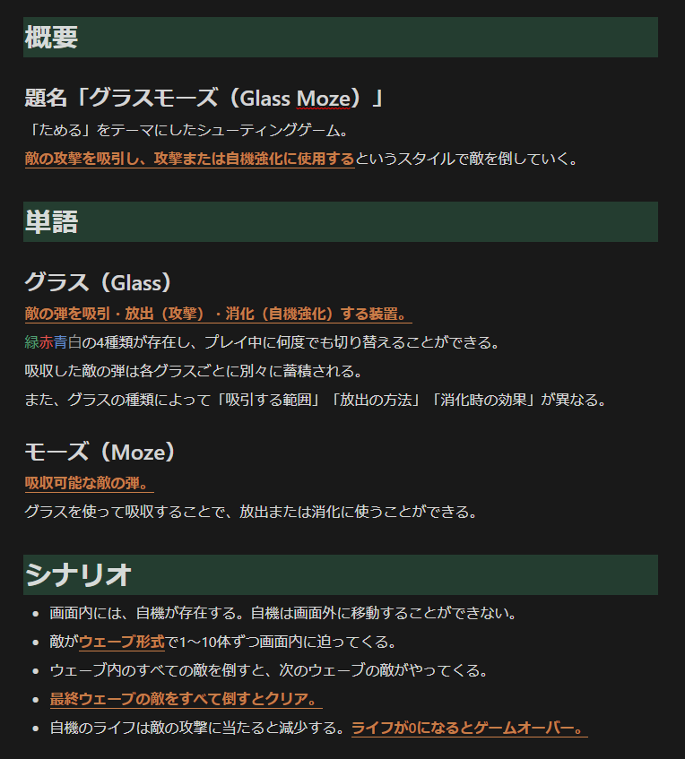

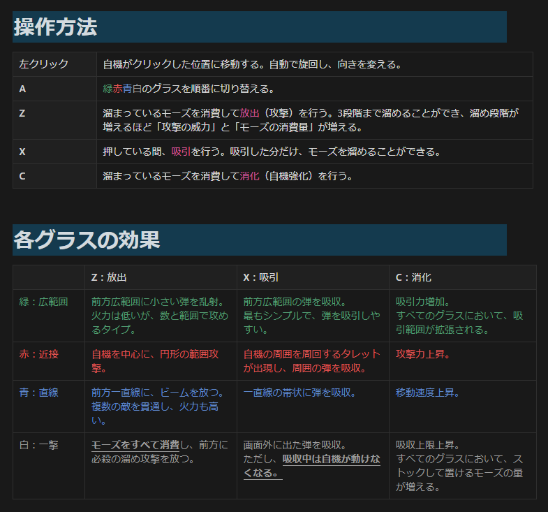

意識したつもりはなかったけど、この**1年前にも似たような発想をしていた**らしい。確かに、似たようなワクワク感もあった。

## (2) *2022.09.12* ／ 公開

この作品は*2022.09.09*に作成が始まり、企画通り*2022.09.12*に公開された。

SEが導入されてなく、ウェーブ数や敵の種類がほんの数種類だけといった具合に、**ゲームとしてかなり不十分**だったけど……[ポップコーン職人](/materials/popcorn-chef)のときを忘れてはいけない。

その後は[Beat a bit](/materials/beat-a-bit)の方に移ってしまったため、この作品には当時からまだ手が加えられていない。けれど、以前のいくつかの作品のように、ふと戻ってきて進行する可能性はある。

でも、せっかく醍醐味なレベルデザインだけが残ってるんだから、**一人じゃなくてどこかでわいわい仕上げていきたいな**。
