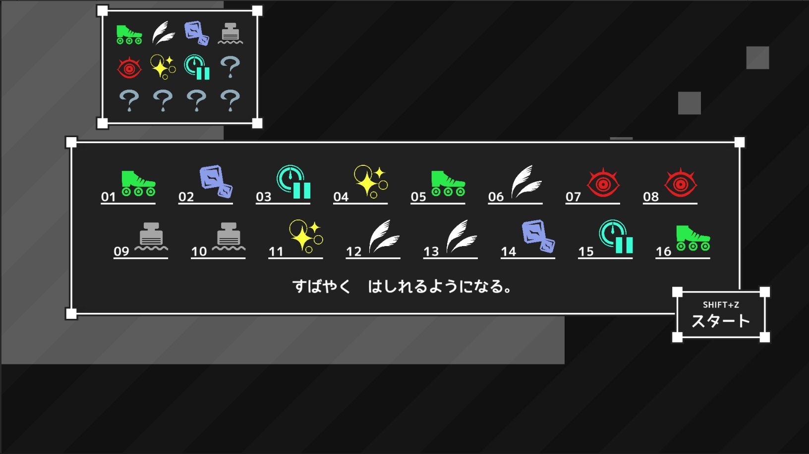

# 構想

1人プレイの **『謎解き』 × 『リズム』 × 『アクション』** ゲーム。2Dの横スクロールステージで、プレイヤーは移動・ジャンプをしてゴールを目指す。ただし、ステージは仕掛けが速すぎたり壁が高すぎたりして、そのままではクリアできない。

そこで、ステージの開始前に、**発動する2秒毎の効果を決めることができる。** また、プレイ中は効果が切り替わるのに合わせてメトロノームが鳴り続ける。

```
例）
【0～2秒】速すぎる仕掛けを突破するために、「時間を遅らせる」を選択
【2～4秒】高い壁の辺りに来るので、「空中ジャンプを可能にする」を選択
【4～6秒】モンスターが多いので、「見つからなくなる」を選択
【6～8秒】...
```


この画像は、ステージへの挑戦前に発動する効果を選んでいる様子。




このように、プレイヤーは**ステージを探索して、特殊効果の順番を考えて、その順番に合わせてゴールを目指す**。失敗したら、また特殊効果の順番を考えて試行錯誤する。

また、ステージが進むほど、選べる特殊効果の数は増え、ステージも長くなる。
