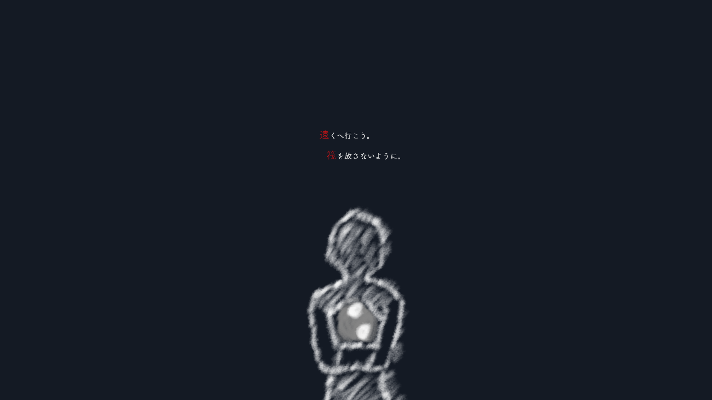
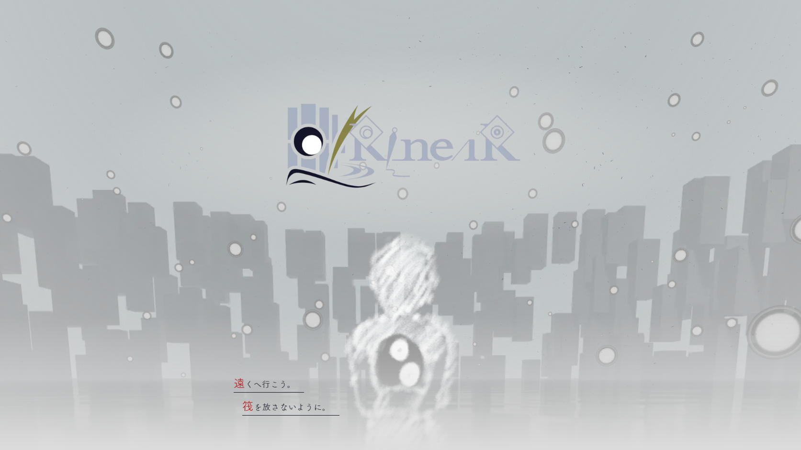
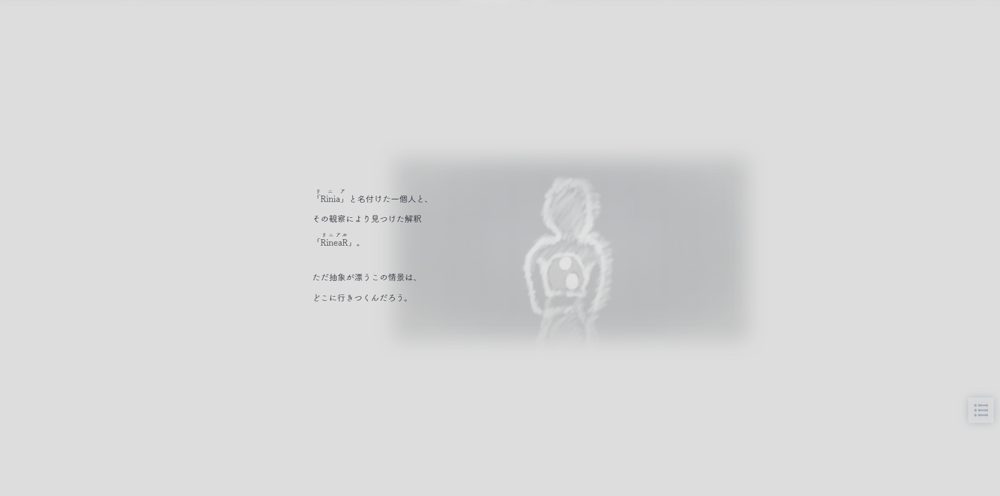
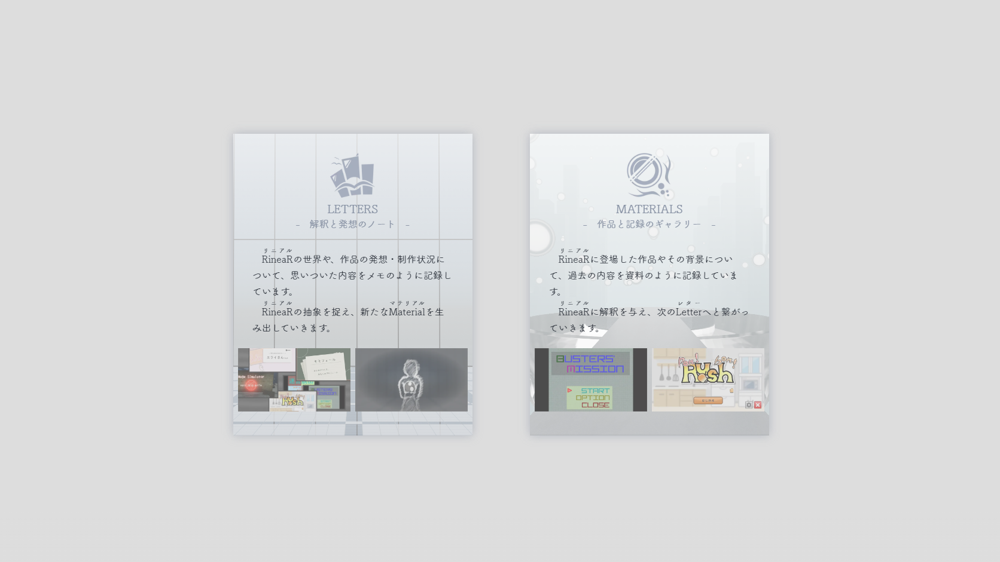
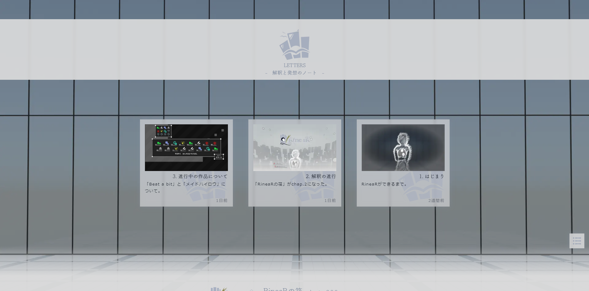
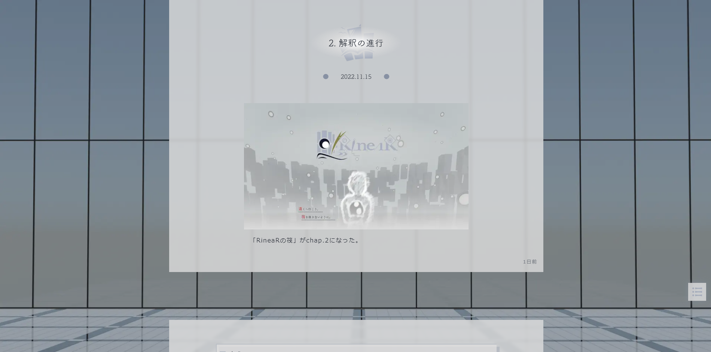
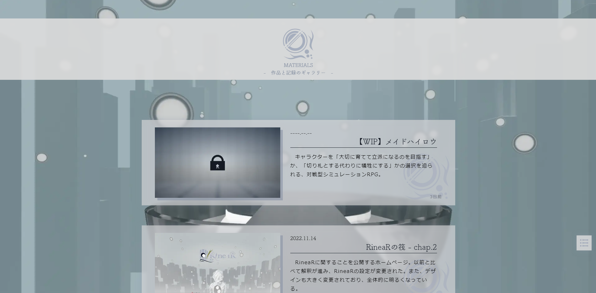
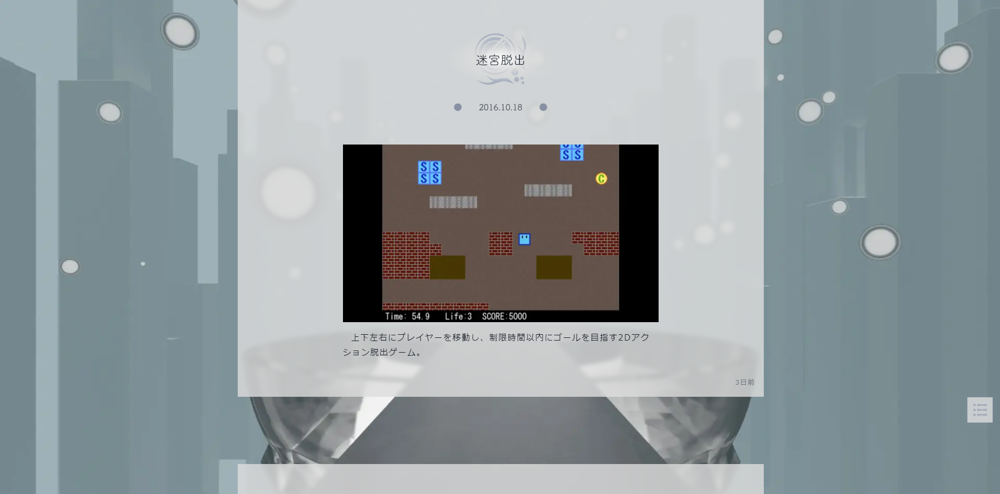
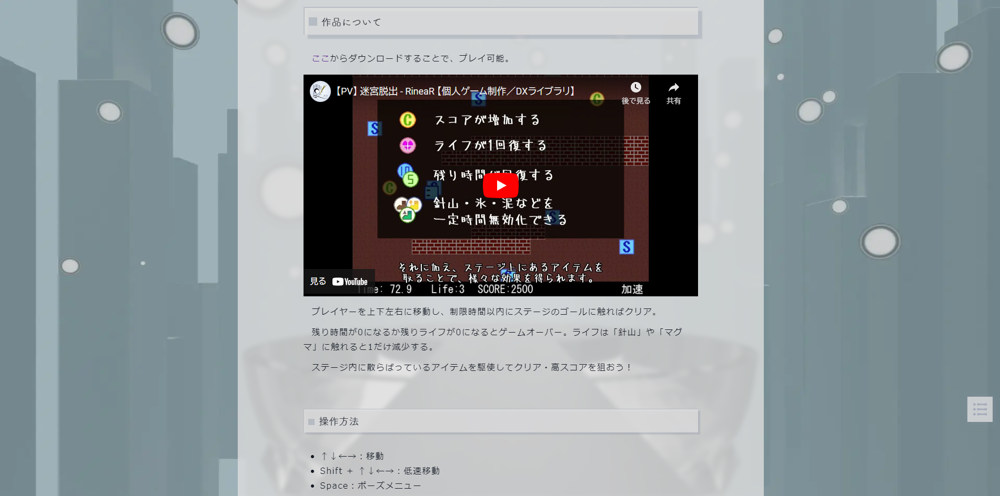
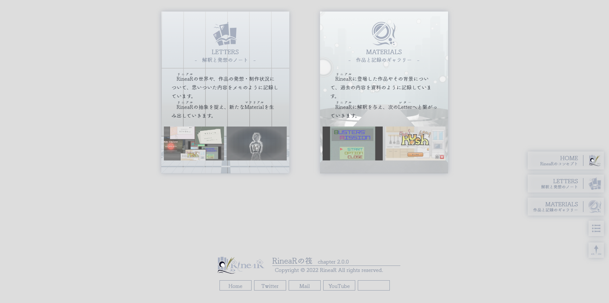

# 現在の姿

RineaRの筏 chap.2は、[RineaRの筏 chap.1](/materials/rinear-raft-chap1)を新しくしたもの。

**デザインが一新**されて全体的に明るくなり、**シンプルな作り**になったことで軽くなった。また、**すべてのコンテンツの内容が変更**された。

## Home

## Letters

素早く閲覧できるよう、最小限の情報だけを書いて、出現アニメーションはあえて加えてない。

## Materials

素早く閲覧できるよう、出現アニメーションはあえて加えてない。Letterとは違って、Materialは1つ1つが大切なため、説明や公開日を書いている。

## フッターとメニュー

# 思い出

## chap.1から

この話は、[RineaRの筏 chap.1](/materials/rinear-raft-chap1)の続き。

*2022.07.03*（4か月前）、RineaRの筏が公開され、その後

- スマホで閲覧するときにカクカクするので、軽くしたい
- ページの作りが複雑で維持するのが大変なので、シンプルにしたい
- 記事を書くのに結構な労力がかかるので、簡単に記事を書けるようにしたい
- RineaRの解釈に進展があったため、コンセプトを変更したい

といった要望を抱えていた。

## chap.2へ

*2022.11.03*、[Beat a bit](/materials/beat-a-bit)と[メイドハイロウ](/materials/made-highlow)を並行して組み上げている過程で、構想の熟成が必要になったタイミングがあり、RineaRの筏は改修されることになった。RineaRではこんな感じに、作品の組み上げをあえて遅らせ、自然な解釈を待つことが多い。

コンテンツのレギュレーションが変化したため、すべてのコンテンツをはじめから記述した。普段から作品を組み上げる過程を記録する癖がなかったらしく、記憶の彼方と各所に残っている履歴を引っ張り出して、どうにか復元した。そのため、残っている記録はほとんどが偶然残っていたもの。

# つながり

- [8. RineaRの筏 chap.1 | RineaRの筏](/materials/rinear-raft-chap1)
- [2. 解釈の進行 | RineaRの筏](/letters/002)

