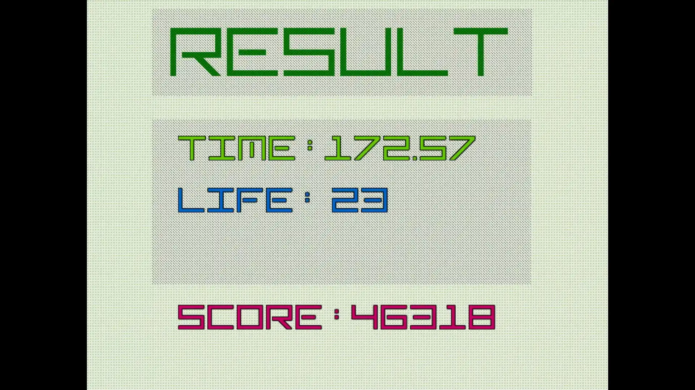

# 紹介動画

<iframe src="https://www.youtube.com/embed/YzqFIVbV4-c" title="YouTube video player" allow="accelerometer; autoplay; clipboard-write; encrypted-media; gyroscope; picture-in-picture" allowFullScreen></iframe>

# ダウンロード

ゲームのファイルを[ここ](https://www.dropbox.com/sh/h23lhcyl0cwjlh5/AADIuiV0vj4hXrInV_j6YmOqa?dl=0)からダウンロードしてください。

# ルール

ステージ上のすべての敵を倒すとステージが進み、プレイヤーのライフが回復します。
最後のステージに待ち構えるボスを倒すとクリア。
クリアすると、残りライフと経過時間からスコアが算出されます。ハイスコアを狙おう！
ただし、残りライフが0になるとゲームオーバー。ライフは敵の攻撃に当たると減少します。

## 操作方法（メニュー時）

- ↑↓←→：カーソル移動
- Z：決定

## 操作方法（ゲーム時）

- ↑↓←→：移動
- Z：剣を振る
- M：ポーズメニュー

# 攻略データ

## ステージ1

すべての敵を倒すとクリア。
プレイヤーを追尾し、剣で近接攻撃してくる敵が7体いる。 なるべくダメージを受けないように、慎重に攻撃していこう。

## ステージ2

すべての敵を倒すとクリア。
剣で攻撃する敵に加えて、プレイヤーの周りを旋回しながら銃で遠距離攻撃してくる敵が現れる。
中央の壁を使って弾を防いで、射撃後の隙に攻撃しよう。

## ステージ3（ボス）

ボスステージ。ボスの体力を0にするとクリア。

ボスは「プレイヤーの追尾」と「攻撃」を交互に繰り返す。
攻撃は3種類あり、それぞれ予備動作が違うため、発動前に判別が可能。

- 杖を振りかぶる動作→薙ぎ払い
- 炎を溜める動作→衝撃波
- 杖を高く掲げる動作→メテオ

どの攻撃が来るかを見極めて回避しよう。

ボスの残りHPが一定以下になると、大技とともに形態変化を行う。
この大技ではボスが杖を掲げ続け、フィールド全体に大量のメテオが降ってくる。また、この大技の発動中はボスへ攻撃が与えられないため、避けることに専念しよう。

形態変化以降はボスの各攻撃が強化される。さらに、大技の直後はフィールド上にメテオの炎が残った状態で戦うことになるため、炎がない場所にボスを誘導して戦いやすくしよう。

ボスを倒すとクリアとなり、クリア時間と残りライフからスコアが計算される。

# 使用ツール

## 言語・ライブラリ

- C++（Microsoft Visual C++）
- [DXライブラリ](https://dxlib.xsrv.jp/)
