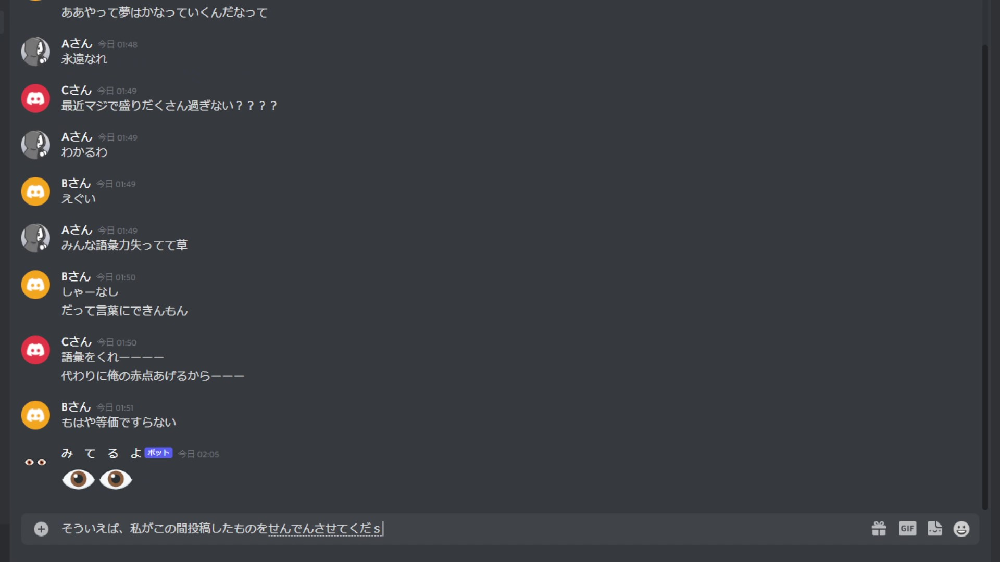

# 紹介動画

<iframe  src="https://www.youtube.com/embed/Vto86ts0cQ8" title="YouTube video player" allow="accelerometer; autoplay; clipboard-write; encrypted-media; gyroscope; picture-in-picture" allowFullScreen></iframe>

# 内容

私はdiscordをサブ画面で開いていることが多いんですが、たまにチャットの静寂の中`○○○が入力中...`って出てることに気付くんです。

それで、ずーーっとそのまま入力中が続いてる時って気になるじゃないですか。何か長考してるのかな、それとも長文なのかな、それとも送ろうかどうか思い悩んでるのかなってそわそわするわけです。

そういう時に私はよくふざけて**2つの目の絵文字**だけを送るんですが、これが見事に~~気色悪いと~~私の中で好評だったので、自動化しようと考えたわけです。

仕組みは簡単で、**入力中の状態が検知されたとき、1%の確率で数秒後に目の絵文字を送ります。**

ただ、相手がメッセージを送り終わってから「み て る よ」ってしてもなんか違うので、**送信の前に「メッセージが過去5分間送信されていないこと」をチェックします。**

あとは名前を「み て る よ」にして、アイコンも目の絵文字にして恐怖感を醸し出したら完成。ほんとにこれだけなので、3時間ほどで完成しました。結果としては満足の行く出来です。今でも一生懸命みんなの投稿に対して「み
て る よ」をしてくれています。

要望があったり、魔が差したりしたら公開してみんなが自由に使えるようにしようかなと思います。こんなふざけた子でよければ。

ちなみに結局私も引き続き「み て る よ」してるので、ただ視線の数が増えただけでした。ごめんね。
