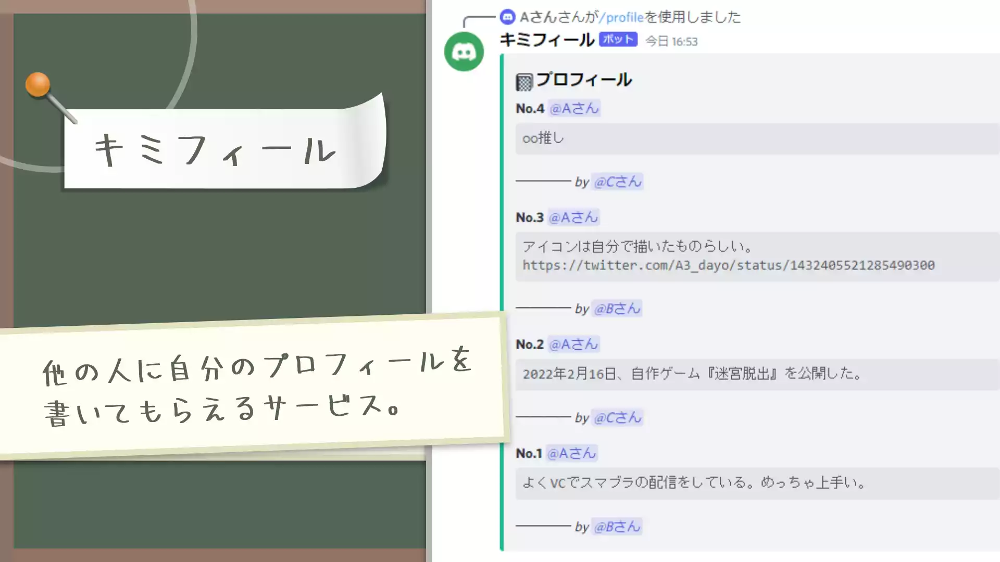
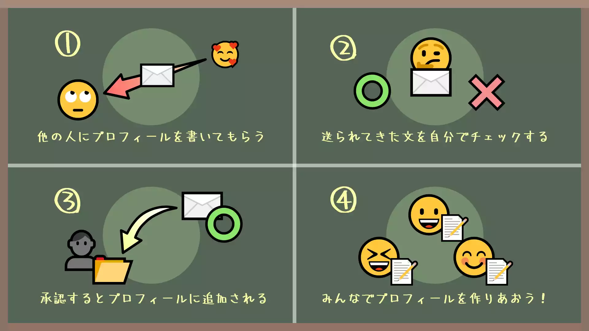

# 紹介

「キミフィール」とは、他の人に自分のプロフィールを書いてもらえるサービスです。 現在はdiscord botとして実装されています。

「誰でも気軽に作れて、気軽に内容を書き合えるwiki」をイメージしています。 「200字まで書けるカード」という単位で内容を構成することで、ページや文書の面倒なフォーマットをサービス側に委ねています。

本来wikiといえば、人物だけでなく様々なコンテンツの説明を記述できるものですが、現在はプロフィールのみに絞っています。

プロフィールを書いてもらう流れとしては、

- 自分のプロフィールを誰かが書いてくれる
- 送られてきたプロフィールをチェックし、承認 or 却下 を決定する
- 承認すれば、自分のプロフィールの一部となる

と言った感じです。

他人にプロフィールを書いてもらえるとは言っても、なにか不都合な内容を載せられたりすると困ってしまいますよね。 そこで、プロフィールを掲載する際にレビューができる機能を取り入れました。

# 使い方

すべての機能は[ガイド](https://kimifile.notion.site/473ae50d379048a39fe76437bf1c4b1c)に載っています。
