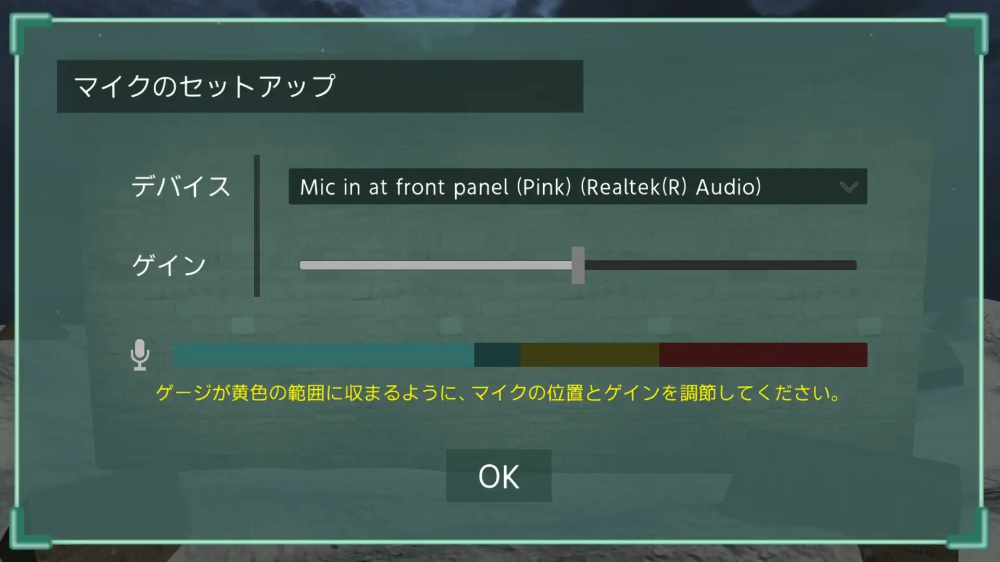
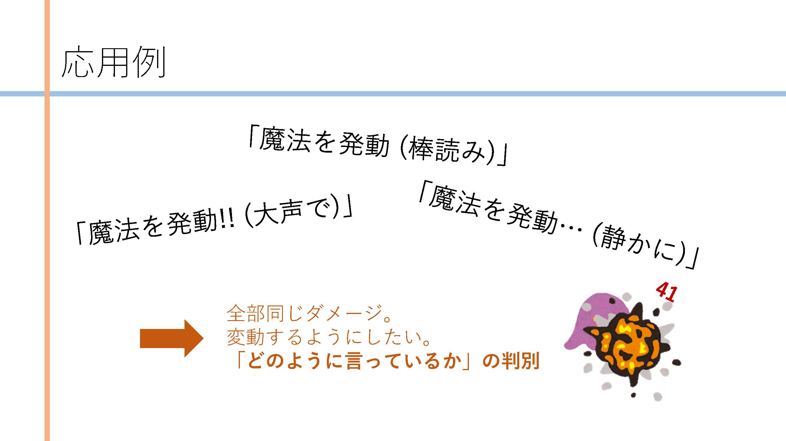

# 紹介動画

<iframe src="https://www.youtube.com/embed/gBHHT_64NUg" title="YouTube video player" allow="accelerometer; autoplay; clipboard-write; encrypted-media; gyroscope; picture-in-picture" allowFullscreen=""></iframe>

# 使い方

今回は、**「呪文を唱えて杖を振ることで、ゲーム内で魔法が発動できる」** みたいな機能を実現しました。

Wiiリモコンを杖に見立てて、特定のモーションをしながらマイクに向かって呪文を放つと、ゲーム内で魔法が発動します。

## 使用の流れ

### セットアップ

まずはタイトル画面から進むと、**マイクのセットアップ**となります。ここで、使用するマイクを選択し、音声の入力感度も調整できます。

次に、**Wiiリモコンをセットアップ**します。4回ほど指定の向きでWiiリモコンを静止させ、内部に搭載されているジャイロセンサを校正していきます。

次に、**音声認識が正常に行われるかどうかをテスト**します。

WiiリモコンのAボタンを押しながら、画面に表示された文章を話すことで、正しく認識されることを確認します。この工程が完了すると、実際に魔法を詠唱する画面に移行します。

### 魔法の詠唱

この画面が、魔法を詠唱するシーンの初期状態です。 画面内にある杖はWiiリモコンの向きと連動しています。

**杖を特定の向きに向けると赤・青・紫などの色に光り、この状態でAボタンを押す**と魔法陣が展開されます。

* 杖を自分から見て左方向に向け、Aボタンのある面が手前に来るようにする（振り払うような動作） →
  **「ファイアブラスト」**
* 杖を自分から見て正面方向に向け、Aボタンのある面が上に来るようにする（溜めるような動作） →
  **「レーザービーム」**
* 杖を自分から見て上方向に向け、Aボタンのある面が後ろに来るようにする（高く掲げるような動作） →
  **「メテオレイン」**

これが魔法陣が展開された状態です。この状態で、**表示された呪文をマイクに向かって話す**と、呪文の文字が点滅します。

呪文の詠唱に成功すると魔法陣が輝き、魔法が発動可能な状態になります。この状態で**特定のモーションを行う**と、魔法を発動することができます。

* 「ファイアブラスト」 → 杖を前方向に振る
* 「レーザービーム」 → 杖を前方向に突き出す
* 「メテオレイン」 → 杖を下方向に振り下ろす

呪文の詠唱時に、表示されたものとは違う文章を読み上げた場合など、正しく認識が出来なかった場合はこの状態にならず、再び音声の入力を受け付けます。

**発動に成功すると、画面内でエフェクトが再生されます。**その後、初期状態に戻り再び魔法の詠唱を受け付けます。

# この作品について

## 始まり

この「メイジ・シミュレータ」のアイデアが浮かんできたのは、**2019年末**でした。

その頃にしばらくずっと、**「ゲーム内でリアルに魔法を詠唱したいな...」**っていうことをぼんやり思っていました。

そして、ちょうどその頃に自由に研究ができる機会があったため、**「モーションとか唱え方によって、魔法の強さが変わったりしたら面白いな！」**と思って、魔法詠唱のための音声解析を研究しようとしました。

そうして自前データを収集したり、デモンストレーションをするために作られたのがこの「メイジ・シミュレータ」の始まりです。

本来は、このアプリケーションを使って**みんなの「本気の詠唱」と「棒読み」の音声データを収集し、その違いを解析してゲームに組み込む**つもりでした。

作品を展示する機会もありますし、大きなスクリーンを使って、**「杖を振って魔法を唱え、迫りくる敵を撃ち落とす3Dシューティングゲーム！！」**って宣伝で展示したら、盛り上がりそうと思いませんか？

「唱えるのが恥ずかしい！」って問題も、窓が割れるくらい大音量のBGMと、一緒に呪文を唱えてくれるナビゲーション音声があれば大丈夫だと思います。

制作チームを集めて、研究の成果を使ったゲームを作る。最高じゃないですか！

## 実際に起きたこと

そう思った矢先、流行りの病やその他様々な不運が重なって、研究がまともに出来ない状態になりました。 

そこで、**「音声認識とモーション認識だけを残して、せめてゲーム作品にしよう」**と思ったわけです。ですが、そこでまた壁にぶつかります。

今回、「なぜWiiリモコン？」と思った方もいるでしょう。理由は簡単で、「それしかなかったから」です。 本当はNintendoSwitchのJoy-Conが欲しかったのですが、あれって結構高いんですよね。8000円くらいします。

そこで、手元にあるWiiリモコンプラスとヌンチャクでどうにか作ろうとしたわけです。**Wiiリモコン側が杖の役割をして、ヌンチャクのスティックで照準を操作したりガードなどをする。**

そうすることに決めて順調に制作を続け、現在のアプリケーションの段階、つまりマイクとWiiリモコンで魔法を発動できるところまで完成しました。

---

......しかし、ここまで来て気付いてしまったんですよね。**Wiiリモコンプラスの機能とヌンチャクが同時に使えないことに。**

どうやらWiiリモコンとの接続に使用しているライブラリ側がそういう仕様らしいです。自分でその部分だけ実装しようかとも思いましたが、締切が迫る中、コストの高い作業を行うにはリスクが伴うため**断念しました。**

締切が過ぎた後も、色々求められたため当プロジェクトについて考えることに疲れてしまい、制作は中断されました。

## 魔法使いにはなれなかった

というところで、現在手元には「Wiiリモコンとマイクで魔法が唱えられるアプリ」だけが残っています。

**それでもまだ諦めてはいません。**

将来、Nintendo Switchまたはそれに類するモーションセンサを購入して、魔法を唱えられるゲームを作って、**みんなが盛り上がってるところを見たいのです。**

今回私は魔法使いにはなれませんでしたが、またいつか、今度はみんなを魔法使いにしたいと思います！

# どのように作られているか

あまりITに詳しくないよって方も、雰囲気でなんとなく分かるような解説をします。

## 全体

今回のアプリケーションはゲームエンジンの[Unity](https://unity.com/ja)をベースに、音声認識ソフトウェアとして[Julius](https://julius.osdn.jp/)、Wiiリモコンとの通信のために[Unity-Wiimote](https://github.com/Flafla2/Unity-Wiimote)を使用しました。

なんとなく気付くかもしれませんが、**画像は外部で発表したものを丁重に使いまわさせていただいてます。**

それよりも、どうですか？素敵で見やすいデザインじゃないですかね。徹夜の脳から生まれたクオリティとは今の自分でもとても思えないです。

それと、今更ですが英語が変だったらごめんなさい、徹夜だったもので。ちなみに現在は徹夜をすることは無くなりました。健康でおめでたいですね。

これがアプリケーション全体の構造です。そんなにわからなくていいです。ざっくり言うと、ゲームがマイクやらWiiリモコンやらと通信をしています。

この中で、「音声認識」「Wiiリモコンと杖の連動」で色々**試行錯誤**をしたので、それぞれ紹介したいと思います。

## 音声認識

音声認識の流れは、こんな感じです。

1. 「この呪文を認識してくれ！」と指定するためのファイルを、**予め用意**しておく。
2. 起動と同時に、音声認識ソフト（Julius）を自動で起動し、**通信を開始**する。
3. 詠唱のタイミングで、「この呪文を認識してくれ！」「認識を開始してくれ！」 という**信号を送る**。
4. 呪文をマイクに唱えると、音声認識ソフトが「正しい文章が認識できたか」を**判定**する。
5. リアルタイムでJuliusから結果が返ってくるため、その**中身を解析**して呪文詠唱の成功・失敗を判定する。

ここからちょっと詳しく解説します。

Juliusでの音声認識には、**認識したい単語が書かれたファイル**をあらかじめ用意する必要があります。 その中身はこんな感じです。

そのため、「ファイアブラスト」のような呪文それぞれに対して、これらのファイルを**自動生成するプログラム**を書きました。

また、**全ての五十音が書かれたファイル**も別に用意します。これは常時、優先度最下位の認識対象にしておきます。

なぜかと言うと、例えば「ファイアブラスト」という文章を認識したいとします。

このとき、音声認識したい単語として「ファイアブラスト」だけを設定してしまうと、**何を喋っても「ファイアブラスト」と認識されてしまいます。**これでは困りますよね。

そのため、ダミーとして他の五十音をすべて、優先度を下げて認識対象に設定してるわけです。

次に、Juliusの認識結果を他のアプリケーションで利用するには、自分のアプリケーションとJuliusの間で通信を行い、そのうえで**メッセージを送り合う**必要があります。

例えば、「これは音声認識のテストです」という文章を認識したいとき、音声認識の結果は次のような形式で受け取ることができます。

成功パターンにはしっかりと**「これは音声認識のテストです」の文字列があります。**

それに対し、失敗パターンでは先ほど設定した**ダミーの五十音が並んでいます。**これによって「正しい文章が発音されたか」を判定すればいいわけです。

まとめると、「メイジ・シミュレータ」の音声認識部分では

* 音声認識に必要なファイルを生成する機能
* 通信を開始し、その接続を維持する機能
* 認識する単語の切り替え、認識の開始などの指示を送る機能
* 送られてきた判定結果が成功・失敗のどちらなのかを判別する機能

を実装しました。

## Wiiリモコンと杖の連動

実はWiiリモコンって**BluetoothでPCと接続が可能**なので、今回はこれを使ってPCと接続しました。

Wiiリモコンから受け取れる信号は、大まかに分けて

* **各ボタン**が押されているかどうか
* **重力**がどの方向を向いているか、どの方向に振ったか（厳密には、三軸加速度センサの値）
* **角度**がどのくらいの速さで変化しているか（厳密には、ジャイロセンサの値）

の3つです。これらを使って、あたかも杖を持っているかのようにWiiリモコンの動きをリンクします。

手始めに、「角度がどのくらいの速さで変化しているか」を受け取って、毎フレーム足していけば行けそう！と思いました。

**......とんでもないブレ。** Wiiリモコンを静止させてても、勝手にあさっての方向を向いていきます。

それはそうで、当然センサには誤差があります。**誤差が蓄積**されて、勝手に杖が動いていってしまう、というのが原因でした。

そこでどうしたかというと、**重力がどの方向を向いているか**を利用して誤差を補正しよう！ となりました。

この時に「実際の重力の向き」から「ゲーム内の杖との誤差」を計算するのがまあ難しくて、うんうん唸りながらメモ帳に計算式を書いてました。 ちょっと難しいことを言うと、行列計算というやつです。**頭オーバーヒートするかと思った。****

悩んでたことも最終的には解決して、実際にこの方法で誤差を補正してみました。 すると、ちゃんと**Wiiリモコンと杖の動きがリンクする！素晴らしい！

こうして、無事にWiiリモコンを杖として扱う準備ができたわけです。あとは、杖の向きやボタンの入力状態から、魔法の発動が成功したか否かを判定するだけなので、制作はスムーズでした。

### 最初から「重力がどの方向を向いているか」だけ使うんじゃダメなの？

Aボタンのある面を上にして、Wiiリモコンをディスプレイ側に向けたとき、重力はBボタン側の方向に向いていますね。
        それでは、Aボタンのある面を上にしたまま、くるっと180度回転させてWiiリモコンを自分の方に向けてみましょう。重力はどの方向に向いていますか？

# 最後に

ここまで読んでいただき、ありがとうございました！

『メイジ・シミュレータ』は現在公開していませんが、文章中でも触れた通り、いつかゲームとして昇華することがあるかもしれません。そのときは、「あっあの時の！」となってくれると嬉しいです！

みなさんもよき魔法使いになれますように！
