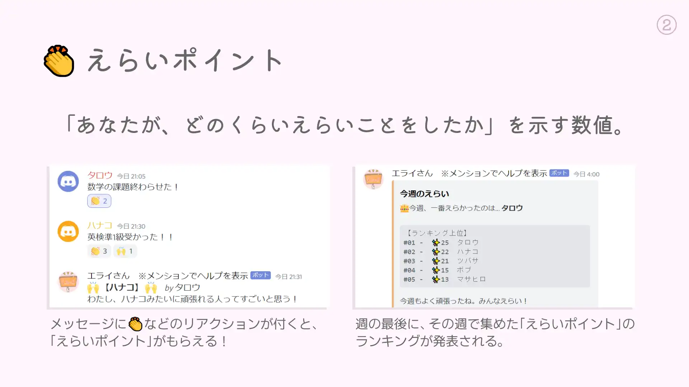
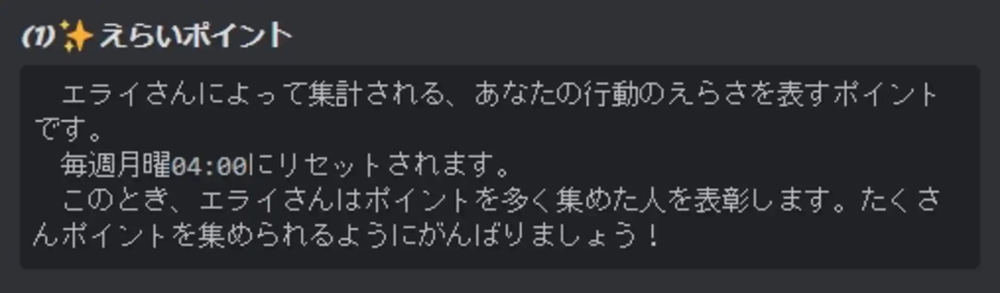
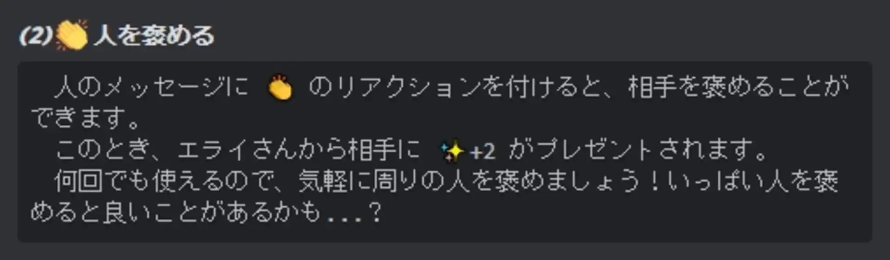
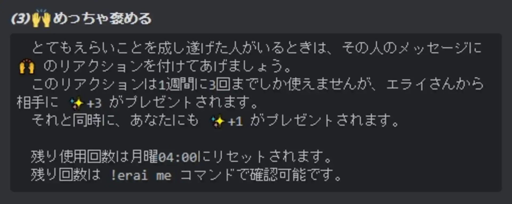
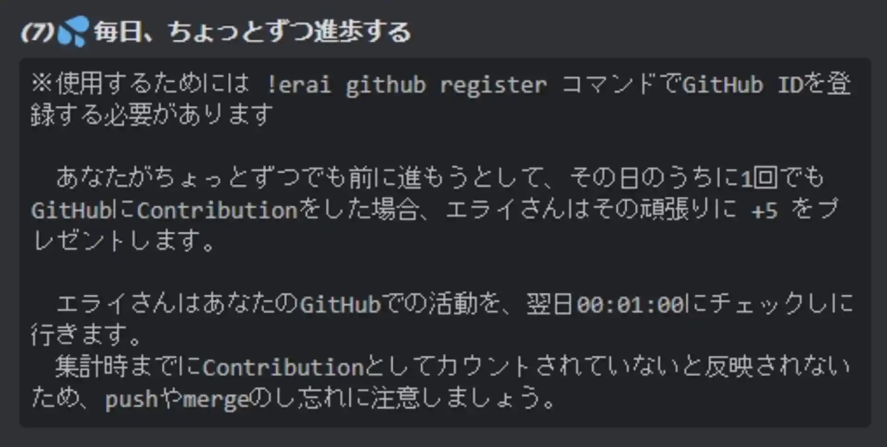
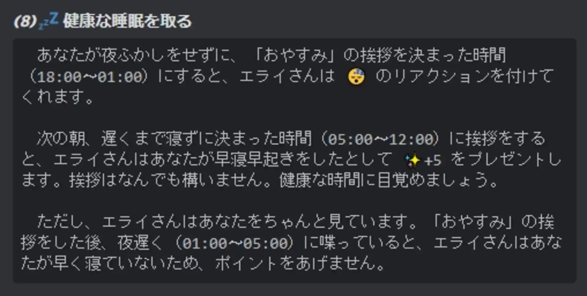

# 利用方法

「エライさんbot」の稼働は終了いたしました。ご利用いただきありがとうございました。

# えらいポイント

えらいポイントとは、あなたの行動の「えらさ」を表すポイントです。毎週月曜4:00にリセットされ、それまでの1週間でのランキングが発表されます。

# 人を褒める

他ユーザーのメッセージに👏 のリアクションを付けることで、相手を褒めることができます。褒めた相手にはえらいポイントが付与されます。

他ユーザーのメッセージに🙌 のリアクションを付けることで、相手に特殊な褒めるアクションを送ることができます。褒めた相手にはえらいポイントが多く付与されます。
ただし、一週間当たりの使用回数には制限があります。

他ユーザーのメッセージに💩 のリアクションを付けることで、相手を咎めることができます。褒めた相手のえらいポイントが減少します。

# えらいことを評価する

毎日、最初のメッセージを送信したときにえらいポイントが付与されます。

他ユーザーを一定回数褒めると自分にもえらいポイントのボーナスが貰えます。反対に、他ユーザーを一定回数咎めると自分にもえらいポイントのペナルティが与えられます。

当botには、ユーザーにGitHubのアカウントを紐づけることが可能です。紐づけた状態で、一日に1回以上Contributeを行うとえらいポイントのボーナスが貰えます。

夜中1時より前に「おやすみ」と送信し、昼12時より前に次のメッセージを送信することでえらいポイントのボーナスが貰えます。ただし、夜中1時～5時の間にメッセージを送信したことが検知された場合は、ボーナスが貰えません。
