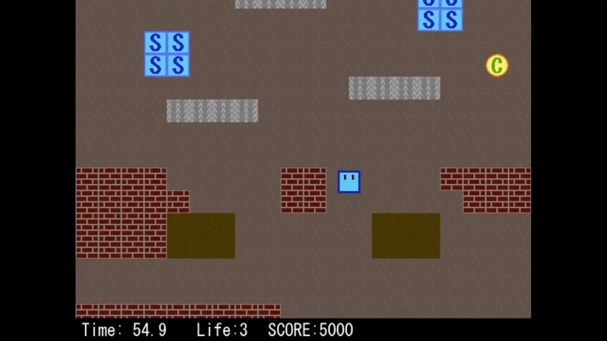
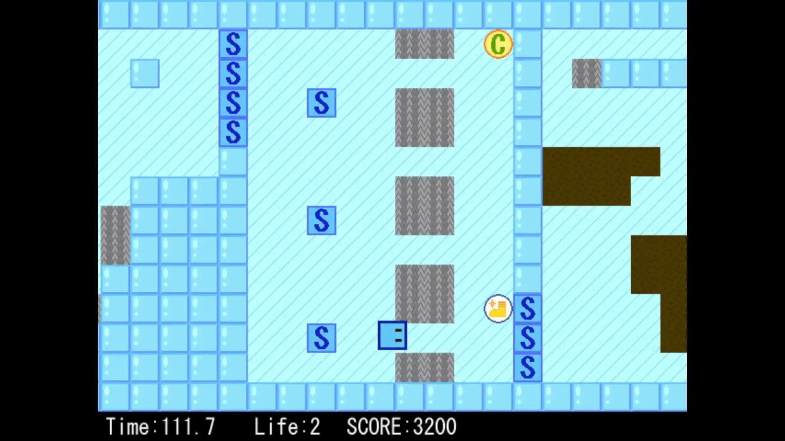
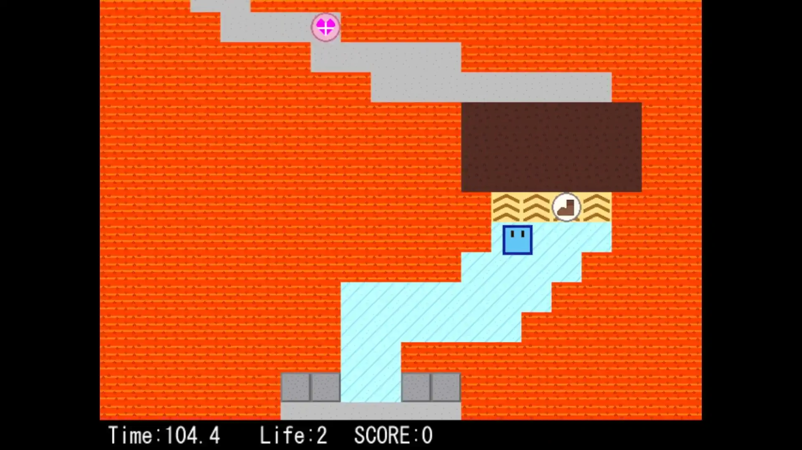

# 紹介動画

<iframe src="https://www.youtube.com/embed/WWZ9mK9vg1M" title="YouTube video player" allow="accelerometer; autoplay; clipboard-write; encrypted-media; gyroscope; picture-in-picture" allowfullscreen=""></iframe>

# ダウンロード

ゲームのファイルを[ここ](https://www.dropbox.com/sh/gwrs6nz2tadpmz0/AADOYp5cqjAhW-ZYqsSsYehQa?dl=0)からダウンロードしてください。

# ルール

プレイヤーを上下左右に移動し、制限時間以内にステージのゴールに触ればクリア。
ただし、残り時間が0になるか残りライフが0になるとゲームオーバー。ライフは「針山」や「マグマ」に触れると1だけ減少します。
ステージ内に散らばっているアイテムを駆使してクリア・高スコアを狙おう！

## 操作方法（メニュー時）

- ↑↓←→：カーソル移動
- Z：決定

## 操作方法（ゲーム時）

- ↑↓←→：移動
- 左Shift + ↑↓←→：低速移動
- Space：ポーズメニュー

# 攻略データ

## ステージ1

泥と針によるギミックがメインのステージ。スピードアップパネルによる加速や、針無効のアイテムが設置されているため、利用しよう。

## ステージ2

氷のギミックがメインのステージ。氷の上では急に止まれないため、勢い余って針を踏まないように低速移動を活用しよう。
また、針が大量に登場する場所は、ダメージ後の無敵時間を利用して一気に駆け抜けてしまうのもアリ。もしくは、氷を一定時間無効化できるアイテムが設置されているため、これを利用して安全に進もう。

## ステージ3

マグマとベルトコンベアのギミックがメインの最難関ステージ。足場が非常に狭い上に不安定なので、正確なコントロールが求められる。
マグマの上では常にダメージを受け続けるうえ、移動速度も低下するため無理矢理突っ切ることはできない。ステージの構造やアイテムの場所を把握し、時には慎重に、時にはダメージ覚悟でゴールを目指そう。

# 使用ツール

## 言語・ライブラリ等

- C++（Microsoft Visual C++）
- [DXライブラリ](https://dxlib.xsrv.jp/)

