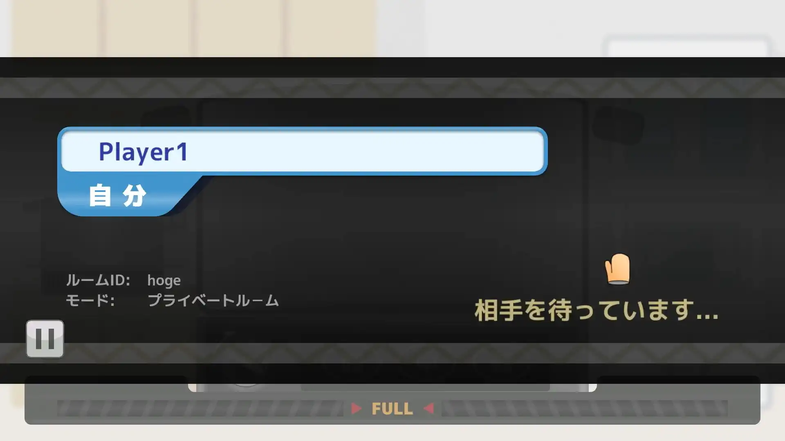

# PV

<iframe src="https://www.youtube.com/embed/qf3eXiC_UrM" title="YouTube video player" allow="accelerometer; autoplay; clipboard-write; encrypted-media; gyroscope; picture-in-picture" allowFullScreen></iframe>

# ゲーム本体

[ここ](https://unityroom.com/games/pon_bon_rush)からプレイ可能です。

# 遊び方

1. スタート画面で「はじめる」をクリックする

2. ロビー画面へ移動するので、左下欄にプレイヤー名を入力する

3. 部屋を作成、または部屋に参加する

* 誰かと遊ぶ場合、「ランダム」の入室ボタンをクリックする
* 特定の人と遊ぶ場合、「プライベート」にあいことばを入力し、入室ボタンをクリックする

4. マッチング画面に移行するので、対戦相手が現れるまで待つ

# ルール

ポップコーンを調理して、調理したポップコーンを食べると画面下の満腹ゲージが溜まっていく。満腹ゲージが先に満タンになったほうが勝ち！

## 豆の調理について

豆が時間経過で上からランダムに降ってくる。
豆はドラッグ＆ドロップすることで移動できるが、移動中はカーソル上に出現するゲージが減っていき、0になると移動がキャンセルされてしまう。
また、豆を移動して鍋の外に捨てることはできない。

コンロの「弱」「中」「強」ボタンを押すと、コンロの火力を調節できる。
豆はコンロの火力が強いほど、コンロの底面に近いほど早く加熱される。
豆を一定量加熱するとはじけて、食べられるポップコーンの状態になる。
はじけたポップコーンをクリックすると食べることができる。 食べると、満腹ゲージが溜まっていく。
豆にはいくつか種類があり、それぞれの効果は以下の通り。

## 豆の送り合い

豆やポップコーンを、爆発などで画面上半分の画面外に出すと相手側へ送られる。
送られる豆は、加熱状態や破裂状態もすべて保持されて相手側で降ってくる。

「ぶきみなまめ」や「なぞのまめ」などの要らない豆は、「ばくだんまめ」を使って…

相手側へ吹き飛ばしてしまおう！

画面下半分の画面外に出た豆やポップコーンは、相手側へ送られることなく廃棄される。

## 注文

ポップコーンを3個食べるごとに、画面右側に注文パネルが出現する。欲しい豆やアイテムをクリックすると、選択したものが画面上から降ってくる。

選べるアイテムはランダムで、豆のほかに上記画像にある「フタ」を注文することができる。フタは一定時間鍋の上側をふさぎ、他の豆が鍋の中に落ちないようにできる。

## イベント

一定時間ごとに、イベントが発生する。 発生するイベントは、以下のうちからランダムで抽選される。

* 「きらきらラッシュ」： きらめくまめが全プレイヤーに3個ずつ降ってくる。逆転のチャンス！
* 「ばくだんラッシュ」： ばくだんまめが全プレイヤーに3個ずつ降ってくる。
* 「あつあつラッシュ」： もえるまめが全プレイヤーに3個ずつ降ってくる。
* 「危険物に注意！」： やばいまめが全プレイヤーに1個ずつ降ってくる。フタやばくだんまめなどで防ごう！
* 「ご注文はなんなりと！」： 一定時間、全プレイヤーが注文し放題になる。

# 使用ツール

## 言語・ライブラリ等

* Unity 2021.3.0f1
* UniRx
* UniTask
* Photon Unity Network 2
